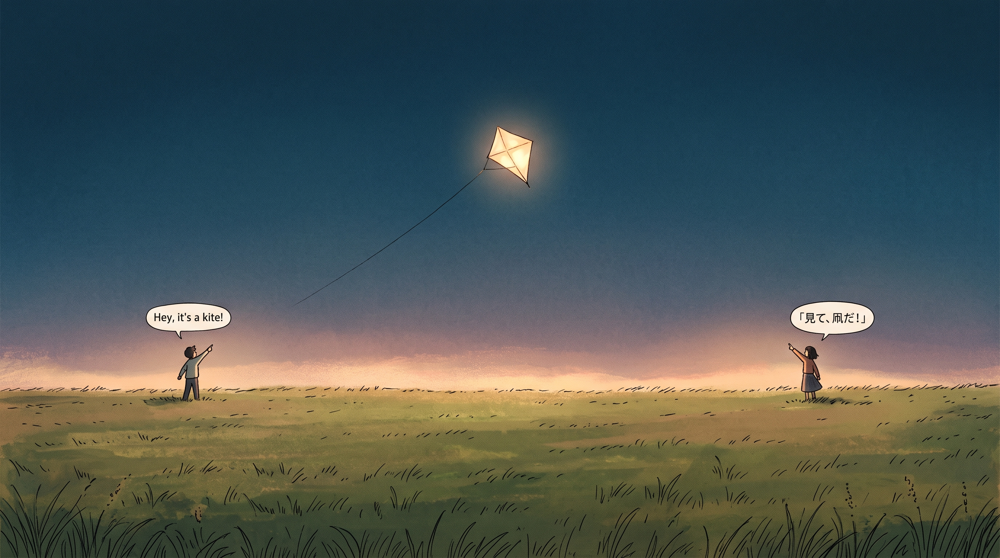
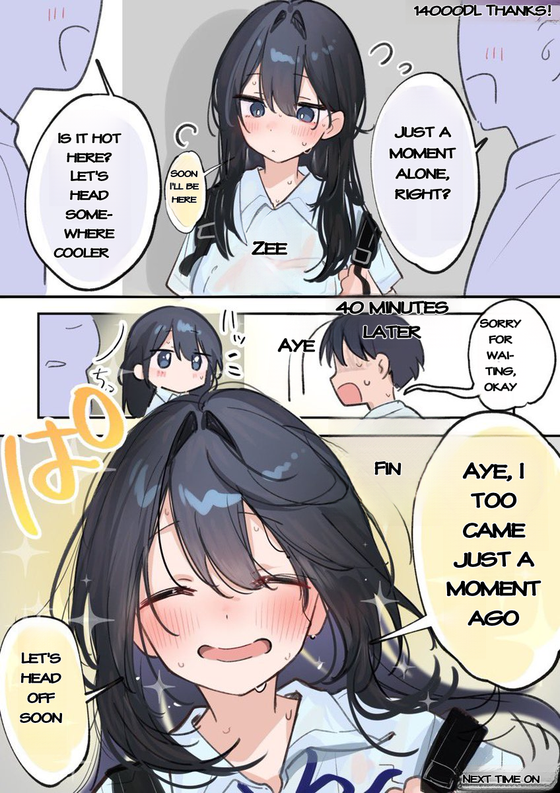
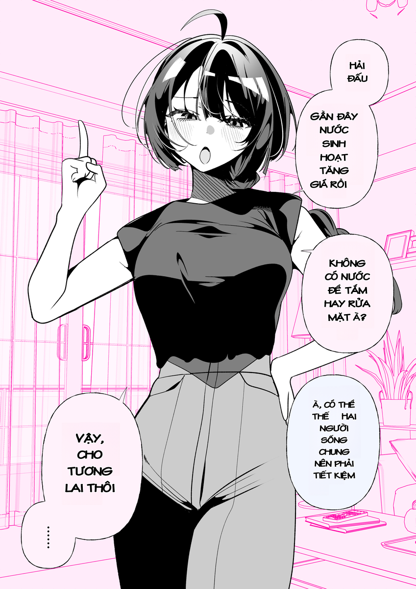
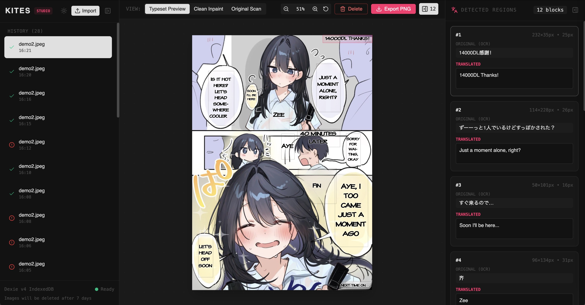
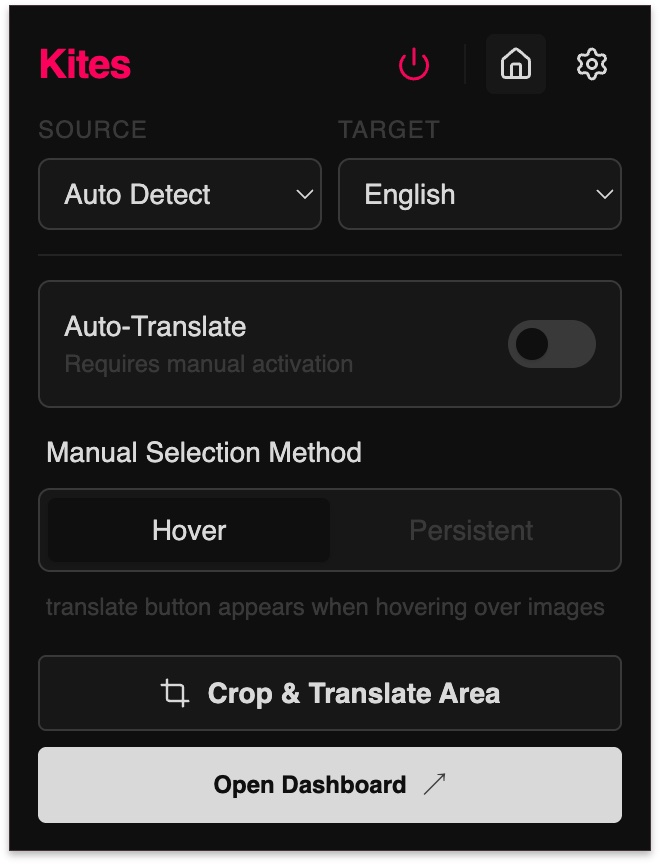
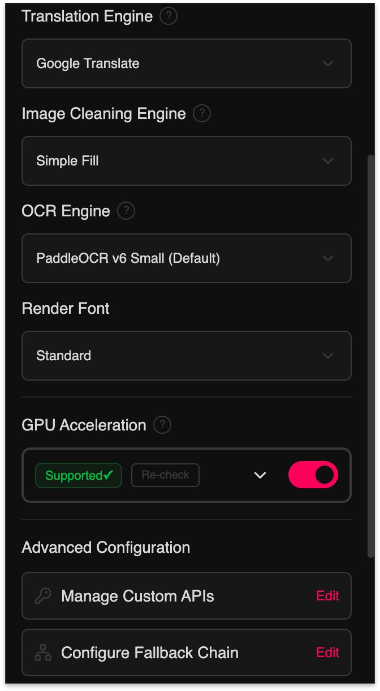

<div align="center">

# 🪁 Kites

### Read Any Manga in Your Language. Directly in Your Browser.
**Zero Python • Zero Servers • 100% Private In-Browser AI Translation**

[](LICENSE)
[](manifest.json)
[](https://developer.mozilla.org/en-US/docs/Web/API/WebGPU_API)
[](package.json)

<br/>

[](./README_images/Gemini_Generated_Image_f7lh52f7lh52f7lh.jpeg)

</div>

---

## 💡 Why Kites?

Traditional manga translators require installing complex Python scripts, gigabytes of CUDA packages, or uploading your private reading history to third-party cloud servers.

**Kites changes that.** It is a lightweight Chrome extension that runs state-of-the-art vision and language models **directly on your graphics card via WebGPU**.

- ⚡ **Zero Setup:** Install the extension and start reading immediately. No terminal, no Python, no dependencies.
- 🔒 **100% Local & Private:** Optical character recognition (OCR) and background cleaning happen on your device. Your images never leave your browser.
- 🎨 **Intelligent Background Repair:** AI inpainting erases foreign text cleanly while preserving linework, screentones, and textures.
- ✍️ **Natural Typesetting:** Automatically measures speech balloons, balances line breaks, fits font sizes, and adapts font colors.
- 🛠️ **Built-in Studio:** Fix mistranslations, resize text balloons, or tweak typography on the fly.

---

## 🖼️ See It in Action

### Japanese → English
> *Story: 佐藤さんは知っていた by [@09ra_19ra](https://x.com/09ra_19ra)*

<div align="center">
<table>
  <tr>
    <th width="50%" align="center">Original Japanese</th>
    <th width="50%" align="center">Kites Translated</th>
  </tr>
  <tr>
    <td align="center">
      
    </td>
    <td align="center">
      
    </td>
  </tr>
</table>
</div>

### Japanese → Vietnamese
> *Source: [Pixiv Artwork #145272482](https://www.pixiv.net/en/artworks/145272482)*

<div align="center">
<table>
  <tr>
    <th width="50%" align="center">Original Japanese</th>
    <th width="50%" align="center">Kites Translated</th>
  </tr>
  <tr>
    <td align="center">
      
    </td>
    <td align="center">
      
    </td>
  </tr>
</table>
</div>

---

## 🛠️ Built-in Kites Studio

Need to polish a scanlation or adjust phrasing? Open the full-screen **Kites Studio** straight from the extension.

[](./README_images/UI-feature/kite_studio_editing.jpg)

- **Interactive Canvas:** Drag and resize speech bubbles with 8-point handles.
- **Side-by-Side Verification:** Compare original, cleaned, and typeset views with one click.
- **Typography Control:** Live font sizing, colors, alignment, and line height adjustments.
- **1-Click Export:** Download clean, translated pages at original resolution.

---

## 🎛️ Read Your Way

Choose how Kites activates while browsing your favorite comic sites:

<div align="center">
<table>
  <tr>
    <th width="45%" align="center">Clean Quick Menu</th>
    <th width="55%" align="center">Customizable Engine Settings</th>
  </tr>
  <tr>
    <td align="center">
      
    </td>
    <td align="center">
      
    </td>
  </tr>
</table>
</div>

- 🖱️ **Hover:** Translate instantly by hovering over any comic panel.
- 📌 **Persistent:** Keep translate badges visible on all comic images.
- 🚀 **Auto-Translate:** Automatically translates new panels as you scroll down the page.
- 🎯 **Right Click:** Translate any image on the web via the browser context menu.

---

## 🧠 Powered by Modern AI

| Component | Options | Description |
| :--- | :--- | :--- |
| **Translation** | **WebLLM** *(Local WebGPU)*<br/>**Cloud Shared Pool** *(Free)*<br/>**Google Translate**<br/>**Custom API** *(OpenAI, Claude, Gemini)* | Run local LLMs right in your browser (Llama 3.2, Qwen 2.5), use our free community pool, or connect your own API key. |
| **Inpainting** | **LaMa Manga** *(Neural)*<br/>**AOT-GAN** *(Fast Neural)*<br/>**Telea Diffusion** *(Instant)*<br/>**Simple Fill** | Erases text strictly inside character boundaries to preserve comic art. |
| **OCR** | **PaddleOCR v3 – v6** | Industry-standard multilingual text detection and recognition. |

---

## 🚀 Quick Start

### Build & Install (2 Minutes)

```bash
# 1. Clone repo
git clone https://github.com/Unheat/Kites.git
cd Kites

# 2. Install dependencies & build
npm ci
npm run build
```

1. In Chrome, open `chrome://extensions/`.
2. Enable **Developer mode** (top-right toggle).
3. Click **Load unpacked** and select the `dist/` folder.
4. Pin **Kites** to your toolbar and start reading!

---

## 📜 License & Acknowledgements

Kites is licensed under the **[GNU General Public License v3.0](LICENSE)**.

Heartfelt thanks to the incredible open-source projects that made Kites possible:
- **[manga-image-translator (Cotrans)](https://github.com/zyddnys/manga-image-translator):** Groundbreaking spatial text grouping and typesetting algorithms.
- **[xianscan-rust](https://github.com/ArbenApura/xianscan-rust):** Dynamic patch inpainting architectures and OCR noise filters.
- **[PaddleOCR](https://github.com/PaddlePaddle/PaddleOCR):** High-speed neural text detection models.
- **[@mlc-ai/web-llm](https://github.com/mlc-ai/web-llm):** Browser-native WebGPU runtime for large language models.

---

<div align="center">
  <sub>Built with ❤️ for manga and comic enthusiasts. Star ⭐ Kites if you love seamless reading!</sub>
</div>
