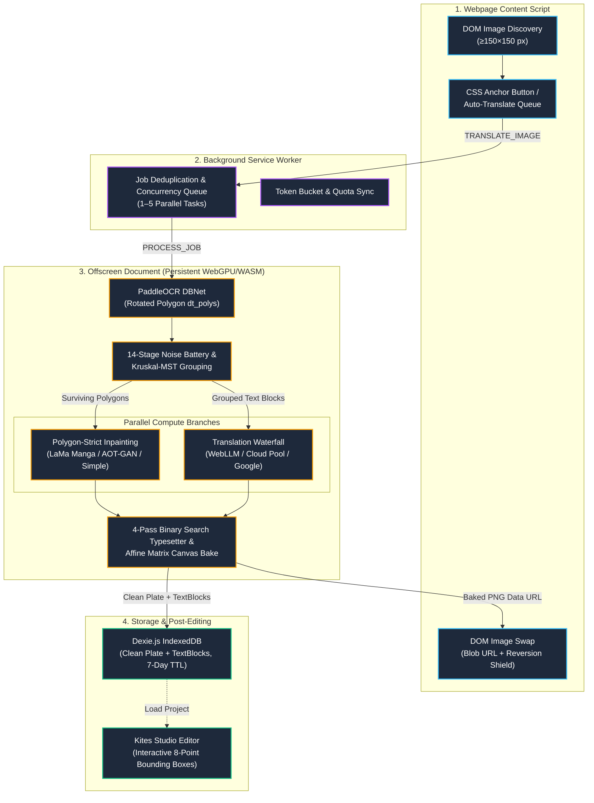

# Kites Technical Documentation Hub 🪁

Welcome to the internal engineering and architectural documentation for **Kites**. This directory provides technical specifications, pipeline algorithms, runtime contracts, and contributor guides.

---

## 🗺️ System Overview & Pipeline Flow

The diagram below illustrates the end-to-end lifecycle of an image translation job across Manifest V3 boundaries:

---

## 🔍 Interactive Pipeline Map (`workflow.html`)

For a high-density, interactive inspection of the entire translation algorithm:

👉 **[Open Interactive Workflow (`workflow.html`)](workflow.html)**

### How it works:
- **Zero Dependencies:** `docs/workflow.html` is a standalone, self-contained HTML file generated by the **Archify** compiler from `docs/kites-workflow.json`.
- **How to view:**
  - **Local macOS / Linux:** Run `open docs/workflow.html` in your terminal or double-click the file in your file explorer.
  - **Local Dev Server:** Run `npx serve docs` or view through Vite preview.
  - **Web / GitHub Pages:** Can be hosted directly on static web hosting.
- **Interactive Features:**
  - **5 Specialized Focus Views:** End-to-End Flow, OCR Detail & Filters, Font Search Algorithm, Parallel AI Compute, and Local Storage.
  - **Clickable Nodes:** Click any node to open an inspector drawer with exact mathematical formulas, threshold values, and memory contracts.
  - **Theme Toggle:** Switch between Dark and Light mode.
  - **Export:** Export clean vector SVG or high-resolution PNG copies directly from the viewer.

---

## 📖 Documentation Index

### 🏛️ Architecture & Core Internals
1. **[System Architecture Overview](architecture/overview.md)**
   - Manifest V3 Chrome Extension architecture
   - Service Worker messaging and explicit RPC targeting
   - Isolated Offscreen Document runtime (WebGPU sandbox)
   - IndexedDB storage schema (Dexie.js) and 7-day TTL pruning
   - Single-Page Application (SPA) reversion shielding on sites like X/Twitter and Reddit
2. **[Translation Pipeline & Algorithm Guide](architecture/pipeline.md)**
   - PaddleOCR DBNet polygon extraction and projective crop recognition
   - The 14-stage geometric and text noise filtering battery
   - Kruskal Minimum Spanning Tree (MST) bubble clustering
   - Polygon-strict neural inpainting (LaMa Manga & AOT-GAN 64px dynamic patch bucketing)
   - 4-pass binary search typography layout and affine text transformation

### 💻 Development & Engineering Guides
1. **[Development Setup](development/setup.md)**
   - Toolchain prerequisites (Node.js 22.14 LTS)
   - Enabling WebGPU flags in Chrome
   - Building and hot-reloading with Vite + CRXJS
2. **[Testing & Quality Gates](development/testing.md)**
   - Running automated unit tests with Vitest (`npm test`)
   - Interactive Puppeteer browser tests (`npm run test:e2e`)
   - Real-model visual pipeline testing (`npm run test:visual`)
3. **[Coding Standards & Established Invariants](development/coding-standards.md)**
   - WebGPU memory management and session lifecycle
   - Upstream library workarounds (Vite 8 Rolldown options, popup RPC addressing)
   - Defensive programming rules and logging conventions

---

## 🗄️ Historical Development Archive

Looking for past research, incident logs, or early planning notes?
All development history is preserved in:
- **[`docs/dev-history/`](dev-history/)** — Phase logs (Phases 1–17), Cotrans research reports, Excalidraw whiteboards, and investigation notes.
- **[`docs/fullplan.md`](fullplan.md)** — The master project scope specification and roadmap.
