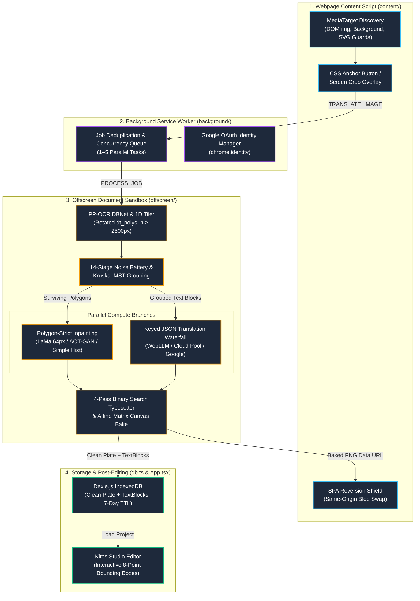

# Kites Technical Documentation Hub 🪁

Welcome to the internal engineering and architectural documentation for **Kites (Spatial Image & Manga Translator)**. This directory contains system specifications, algorithmic guides, runtime contracts, Architecture Decision Records (ADRs), and developer workflows.

---

## 🗺️ System Overview & Pipeline Lifecycle

The diagram below illustrates the end-to-end lifecycle of an image translation job across Chrome Manifest V3 boundaries:

```mermaid
flowchart TD
    classDef web fill:#1e293b,stroke:#38bdf8,stroke-width:2px,color:#fff;
    classDef worker fill:#1e293b,stroke:#a855f7,stroke-width:2px,color:#fff;
    classDef offscreen fill:#1e293b,stroke:#f59e0b,stroke-width:2px,color:#fff;
    classDef storage fill:#1e293b,stroke:#10b981,stroke-width:2px,color:#fff;

    subgraph ContentScript["1. Webpage Content Script (content/)"]
        DOMImg["MediaTarget Discovery<br/>(DOM img, Background, SVG Guards)"]:::web
        HoverBtn["CSS Anchor Button /<br/>Screen Crop Overlay"]:::web
        DOMSwap["SPA Reversion Shield<br/>(Same-Origin Blob Swap)"]:::web
    end

    subgraph BackgroundWorker["2. Background Service Worker (background/)"]
        JobQueue["Job Deduplication & Concurrency Queue<br/>(1–5 Parallel Tasks)"]:::worker
        AuthToken["Google OAuth Identity Manager<br/>(chrome.identity)"]:::worker
    end

    subgraph OffscreenRuntime["3. Offscreen Document Sandbox (offscreen/)"]
        OCRDetect["PP-OCR DBNet & 1D Tiler<br/>(Rotated dt_polys, h ≥ 2500px)"]:::offscreen
        NoiseFilter["14-Stage Noise Battery &<br/>Kruskal-MST Grouping"]:::offscreen
        
        subgraph ParallelCompute["Parallel Compute Branches"]
            InpaintEng["Polygon-Strict Inpainting<br/>(LaMa 64px / AOT-GAN / Simple Hist)"]:::offscreen
            TransWaterfall["Keyed JSON Translation Waterfall<br/>(WebLLM / Cloud Pool / Google)"]:::offscreen
        end

        Typesetter["4-Pass Binary Search Typesetter<br/>& Affine Matrix Canvas Bake"]:::offscreen
    end

    subgraph StorageLayer["4. Storage & Post-Editing (db.ts & App.tsx)"]
        IndexedDB["Dexie.js IndexedDB<br/>(Clean Plate + TextBlocks, 7-Day TTL)"]:::storage
        StudioApp["Kites Studio Editor<br/>(Interactive 8-Point Bounding Boxes)"]:::storage
    end

    DOMImg --> HoverBtn
    HoverBtn -->|TRANSLATE_IMAGE| JobQueue
    JobQueue -->|PROCESS_JOB| OCRDetect
    OCRDetect --> NoiseFilter
    NoiseFilter -->|Surviving Polygons| InpaintEng
    NoiseFilter -->|Grouped Text Blocks| TransWaterfall
    InpaintEng --> Typesetter
    TransWaterfall --> Typesetter
    Typesetter -->|Clean Plate + TextBlocks| IndexedDB
    Typesetter -->|Baked PNG Data URL| DOMSwap
    IndexedDB -.->|Load Project| StudioApp
```

---

## 🔍 Interactive Pipeline Map (`workflow.html`)

For a high-density, interactive inspection of the entire translation algorithm:

👉 **[Open Interactive Workflow (`workflow.html`)](workflow.html)**

- **Zero Dependencies:** Standalone self-contained HTML generated by the **Archify** compiler from `docs/kites-workflow.json`.
- **How to view:** Run `open docs/workflow.html` locally or view in any browser.
- **Features:** 5 specialized focus views (End-to-End Flow, OCR Detail & Filters, Font Search Algorithm, Parallel AI Compute, Local Storage) with clickable inspector drawers.

---

## 📖 Complete Documentation Index

### 🏛️ System Architecture & Subsystems
1. **[System Architecture Overview](architecture/overview.md)**
   - Manifest V3 Chrome Extension topology and runtime boundaries
   - Background service worker messaging and explicit RPC targeting
   - Persistent Offscreen Document sandbox for WebGPU/WASM
   - IndexedDB storage schema (Dexie.js) and 7-day TTL pruning
2. **[Translation Pipeline & Algorithm Guide](architecture/pipeline.md)**
   - 1D vertical tiling for tall webtoons ($h \ge 2500\text{ px}$)
   - PaddleOCR DBNet rotated polygon detection and projective crop recognition
   - 14-stage geometric and text noise filtering battery
   - Kruskal Minimum Spanning Tree (MST) bubble clustering
   - Language-aware panel reading order (`sort_regions` row-band clustering)
   - Polygon-strict neural inpainting (LaMa Manga & AOT-GAN 64px dynamic patch bucketing)
   - Keyed JSON Protocol for dialogue translation
   - 4-pass binary search typography layout, balanced wrapping, and affine matrix placement
3. **[Cloudflare Zero-Cost Worker Backend](architecture/backend-worker.md)**
   - Edge gateway routing (`api.12094852.xyz`) and Cloudflare WAF integration
   - Google OAuth token verification with SHA-256 cryptographic anonymization
   - Durable Objects with SQLite: rolling 24h quota enforcement with single-upsert optimization
   - Multi-provider waterfall (Mistral, Groq, Google AI Studio, OpenRouter, Workers AI)
   - Token-normalized EMA adaptive timeouts and circuit breaker cooldowns
   - Pre-deploy preview and staging verification workflow
4. **[Content Script & Media Subsystems](architecture/content-script-and-media.md)**
   - Universal Media Discovery: `MediaTarget` abstraction and hidden backing surface resolution (Twitter/X, Pixiv)
   - SVG placeholder filtering (Issue #2 Roliascan queue wedge fix)
   - CSS Anchor Positioning for in-page translation buttons with 3px hover race halo guards
   - SPA image replacement & `MutationObserver` reversion shield with `isSelfMutating` recursion guard
   - Screen Crop translation tool: Xnip-style viewport capture and retina display normalization
5. **[Studio Editor & Typesetting Architecture](architecture/studio-and-typesetting.md)**
   - Clean Plate Storage: non-destructive separation of background plate and structured text blocks
   - Interactive 8-handle bounding box manipulation and zoom/pan viewport normalization
   - Typography font preset registry (Wild Words, Anime Ace, Comic Hand, etc.)
   - Background color sampling: luminance contrast detection for white-on-black vs black-on-white text
   - 4-pass binary search fitting, balanced stanza wrapping, and lossless 1:1 PNG export
6. **[AI Models, Runtimes & Hardware Acceleration](architecture/models-and-runtimes.md)**
   - Hardware detection: WebGPU JSEP shaders with automatic WASM SIMD fallback
   - Complete PaddleOCR registry tiers (`v6-small`, `v6-medium`, `v6-tiny`, `v5`, `v4`, `v3`)
   - Inpainting models: LaMa Manga (Fast Fourier Convolutions), AOT-GAN (Contextual Transformations), and Simple Adaptive Polarity
   - Translation engines: WebLLM (MLC-AI WebGPU), Cloudflare Shared Pool, Google Translate, Custom API
   - Persistent browser Cache API (`kites-model-cache`) and monotonic download progress reporting

---

### 📋 Architecture Decision Records (ADRs)

Key technical decisions and architectural trade-offs are documented under [`docs/decisions/`](decisions/):

- **[ADR-001: Persistent Offscreen Document for WebGPU & AI Runtimes](decisions/ADR-001-manifest-v3-offscreen-document-webgpu.md)** — Why heavy compute runs in an Offscreen Document rather than a Service Worker or Web Worker.
- **[ADR-002: Polygon-Only Contract for Inpainting Engines](decisions/ADR-002-polygon-only-inpainting-contract.md)** — Why inpainting engines strictly receive character polygon masks and never rectangular bounding boxes.
- **[ADR-003: Keyed JSON Protocol for Dialogue Translation](decisions/ADR-003-keyed-json-protocol-for-llm-translation.md)** — Why Keyed JSON replaced delimiter-tagged prompts for LLM dialogue translation.
- **[ADR-004: 1D In-Memory Canvas Tiling for Tall Webtoons](decisions/ADR-004-1d-in-memory-tiled-ocr-for-webtoons.md)** — Why 1D in-memory canvas tiling was chosen over DOM splitting or viewport scrolling.
- **[ADR-005: Dexie IndexedDB Clean Plate Storage Architecture](decisions/ADR-005-dexie-indexeddb-clean-plate-storage.md)** — Why clean inpainted backgrounds are persisted separately from text blocks.

---

### 💻 Development & Engineering Guides

- **[Development Setup](development/setup.md)** — Toolchain prerequisites (Node.js 22.14 LTS), Chrome WebGPU flags, and building with Vite + CRXJS.
- **[Testing & Quality Gates](development/testing.md)** — Automated unit testing (`npm test`), E2E browser tests, and standalone visual tests.
- **[Coding Standards & Invariants](development/coding-standards.md)** — WebGPU lifecycle, defensive programming, docstring requirements, and no magic numbers/strings.
- **[Workarounds & Upstream Mitigations](development/workarounds.md)** — Documented mitigations for Vite 8 / Rolldown, CRXJS 2.7.1, SPA image replacement, and WebGPU state restoration.

---

### 🗄️ Historical Development Archive

All historical development records, research reports, and phase logs are preserved in:
- **[`docs/dev-history/devlog/`](dev-history/devlog/)** — 23 detailed development phase logs covering architectural milestones, bug investigations, and performance tuning.
- **[`docs/fullplan.md`](fullplan.md)** — The master project scope specification and roadmap.
