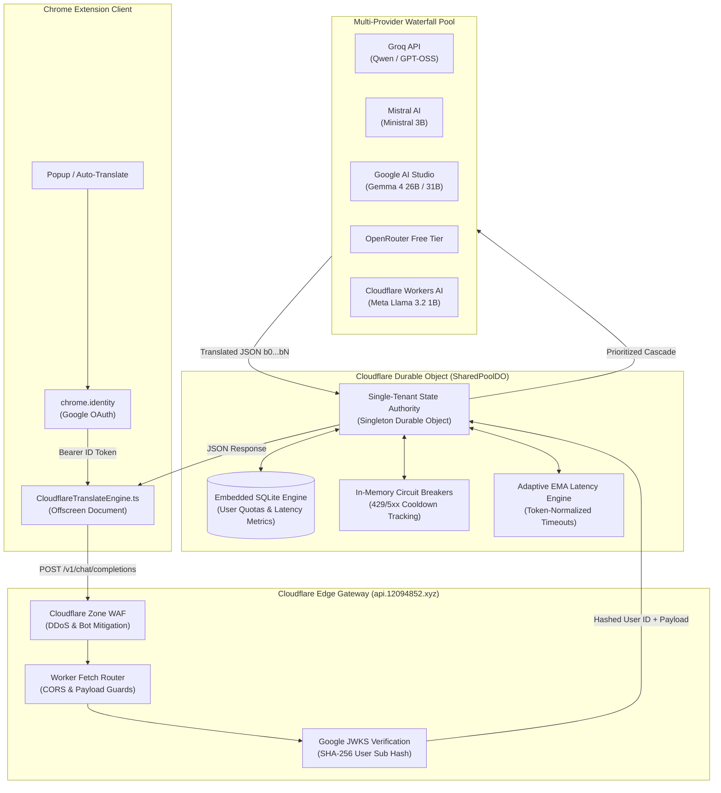
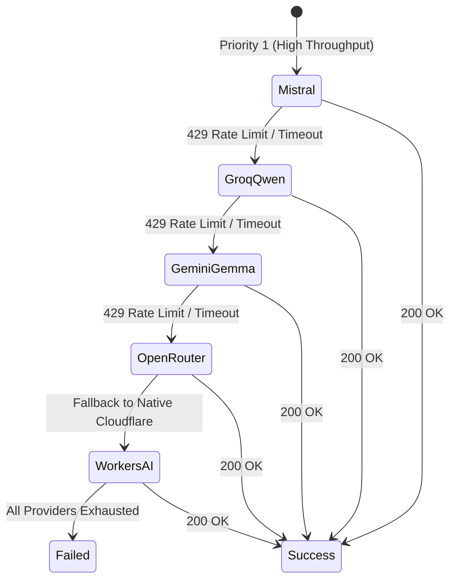

# Cloudflare Zero-Cost Worker Backend Architecture ☁️

The **Kites Cloudflare Worker Backend** (`worker/`) powers the shared community translation pool (`api.12094852.xyz`). It provides high-speed, zero-cost LLM translation to extension users without requiring them to purchase or manage API keys, while strictly enforcing rate limits, quota fairness, and zero-cost operational ceilings.

---

## 🏗️ Architectural Topology



---

## 🔒 Authentication & Privacy Preservation

1. **Google Identity Federation:**
   - Uses Chrome's native `chrome.identity.getAuthToken` to retrieve an OpenID Connect Google ID token.
   - The worker verifies the token's RSA/ECDSA signature against Google's live JSON Web Key Sets (JWKS) (`https://www.googleapis.com/oauth2/v3/certs`).
   - Tokens are cached in-memory with a 5-minute TTL to prevent redundant JWKS fetches.
2. **Cryptographic Anonymization (Zero PII):**
   - The user's Google subject identifier (`sub`) is hashed using SHA-256 with a salt:
     $$\text{UserHash} = \text{SHA256}(\text{GoogleSub} + \text{Salt})$$
   - No names, emails, avatar URLs, or personal identifiable information (PII) are ever written to database tables or logged.

---

## ⚖️ Quota Authority & SQLite Storage Optimization

Cloudflare Workers Free Tier permits **100,000 SQLite writes per day**. To prevent quota exhaustion under heavy usage, Kites implements a strict **single-upsert contract**:

### 1. Rolling 24-Hour Window (100 Translations/Day)
- Each user receives an allowance of 100 translation requests per 24 hours.
- The 24-hour window starts upon their **first request** of the period (not a fixed midnight UTC reset), preventing end-of-day traffic spikes.
- In-memory cache (`userQuotaCache`) tracks quotas in memory; exactly **1 SQL upsert** is written per successful translation:
  ```sql
  INSERT INTO user_quotas (user_hash, window_start, used_count)
  VALUES (?, ?, ?)
  ON CONFLICT(user_hash) DO UPDATE SET
    window_start = excluded.window_start,
    used_count = excluded.used_count;
  ```

### 2. Global Safety Ceiling
- A global daily ceiling ($70,000\text{ requests/day}$) safeguards the entire infrastructure against runaway traffic, preserving remaining operational headroom for health checks and background replication.

---

## ⚡ Multi-Provider Waterfall & Resilience

Different free-tier and low-cost AI providers have variable rate limits, latency spikes, and transient outages. Kites organizes providers in a declarative priority waterfall (`providers.ts`):



### 1. In-Memory Circuit Breakers (Zero-Cost Cooldowns)
When a provider returns HTTP 429 (Too Many Requests) or HTTP 5xx:
- The circuit breaker flags the route with an active cooldown:
  - **RPM Exceeded (Requests Per Minute):** 60-second cooldown.
  - **RPD Exceeded (Requests Per Day):** 24-hour cooldown.
- While in cooldown, incoming requests **bypass the broken provider instantly** ($0\text{ ms}$ overhead), eliminating cascading latency.

### 2. Token-Normalized EMA Adaptive Timeout (Phase 22)
Fixed HTTP timeouts either cut off slow large batches or hang unnecessarily on dead providers. Kites calculates dynamic timeouts using an Exponential Moving Average (EMA) of token generation speeds:

$$\text{EstimatedTime} = \text{BatchTokens} \times \text{EMA}_{\text{ms/token}} + \text{BaseNetworkRTT}$$

- Clamped between $\text{MIN\_TIMEOUT} = 2000\text{ ms}$ and $\text{MAX\_TIMEOUT} = 6000\text{ ms}$.
- Hard overall waterfall ceiling: $\text{MAX\_TOTAL\_WATERFALL} = 12,500\text{ ms}$.

---

## 🚀 Pre-Deploy Verification Workflow

To guarantee zero downtime and prevent database corruption, all worker deployments strictly follow the rules in `AGENTS.md`:

1. **Unit & Integration Testing:**
   ```bash
   npm --prefix worker test
   ```
2. **Isolated Preview Deployment (No DB impact):**
   ```bash
   npx wrangler versions upload --cwd worker
   ```
   Generates a private ephemeral preview URL for testing without affecting production users.
3. **Staging Environment Validation:**
   ```bash
   npx wrangler deploy --env staging --cwd worker
   ```
   Executes automated end-to-end tests against an isolated staging SQLite Durable Object.
4. **Production Promotion:**
   ```bash
   npm --prefix worker run deploy
   ```
