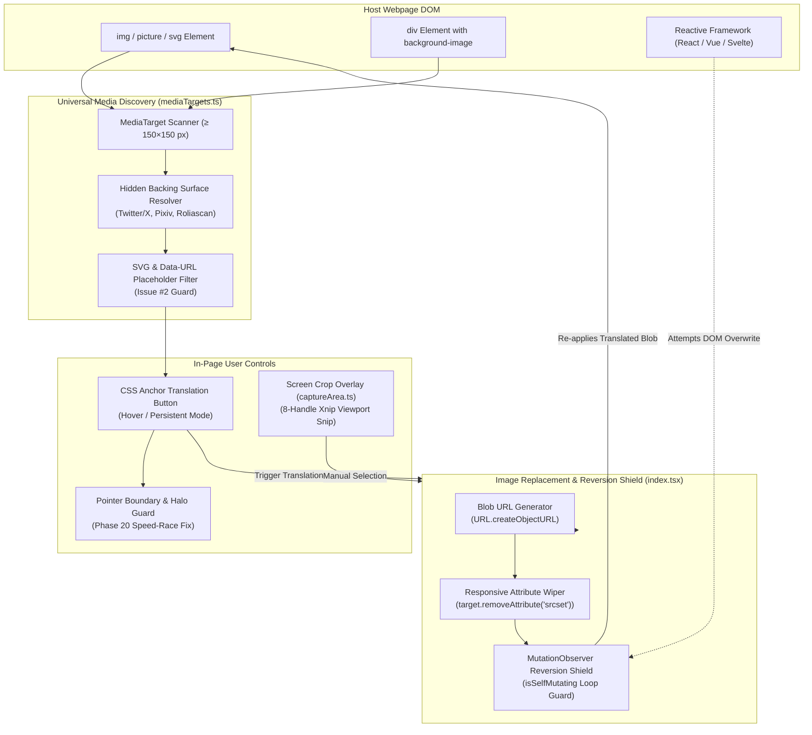
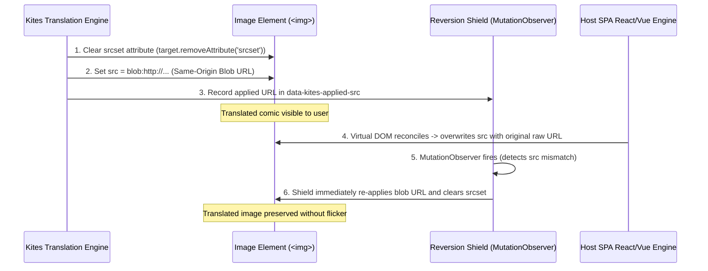
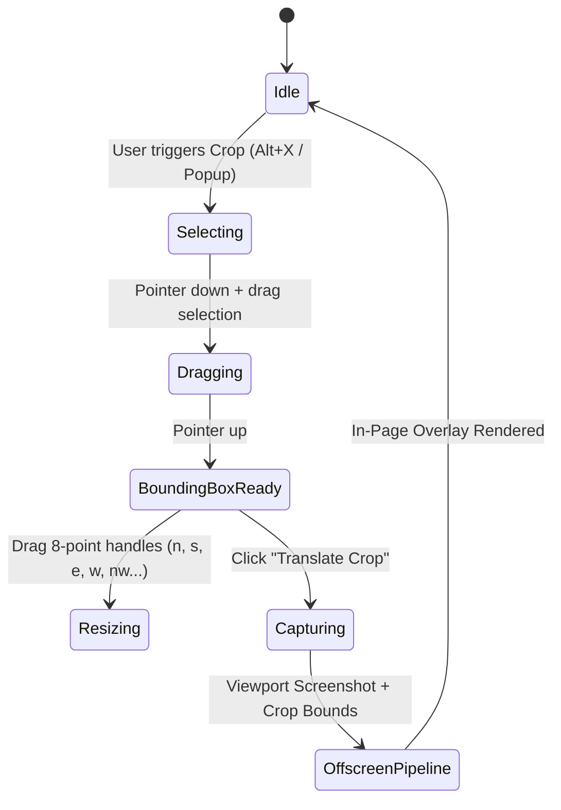

# Content Script & Media Subsystems 🖼️

The Kites **Content Script** (`src/content/`) executes directly in the context of webpages. It is responsible for discovering comic images across diverse web architectures, anchoring non-intrusive UI controls, replacing images safely against reactive SPA frameworks, and providing manual screen-crop capture.

---

## 🏗️ Architectural Topology



---

## 🔍 Universal Media Discovery (`mediaTargets.ts`)

Standard extensions rely on simple `document.querySelectorAll('img')`. On modern comic reader platforms and social media, this approach fails due to complex layout techniques:

### 1. The `MediaTarget` Abstraction
Kites abstracts media elements into a unified `MediaTarget` descriptor:
```ts
export interface MediaTarget {
  kind: 'img' | 'background' | 'svg-image';
  imgElement?: HTMLImageElement;
  sourceElement: Element;    // The DOM node carrying the real image data
  surfaceElement: HTMLElement; // The topmost visible pointer-facing container
  anchorElement: HTMLElement;  // Element to anchor the translation button to
  srcUrl: string;
  hiddenBacking: boolean;
}
```

### 2. Hidden Backing Surface Resolution (Twitter/X & Pixiv)
On platforms like Twitter/X and Pixiv, images are rendered beneath transparent pointer overlays or pseudo-elements (`::after` click interceptors):
- Kites inspects ancestor trees up to depth $D = 3$.
- Matches hidden backing `` elements with their visible bounding box surfaces (size tolerance $\le 20\%$).
- Attaches the translation trigger button to the visible surface while reading pixel data from the backing image.

### 3. SVG Placeholder & Pseudo-Element Filtering (Issue #2 Mitigation)
Many manga readers (such as `roliascan.com`) lazy-load chapters inside empty `div` containers whose `::before` pseudo-element displays a spinner or placeholder as `background-image: url("data:image/svg+xml;base64,...")`.
- **The Problem:** Naive scanners picked the SVG placeholder before the real comic image loaded, translating a blank spinner and locking the concurrency queue.
- **The Mitigation:** Kites filters all SVG data URLs, blurhashes, and 1×1 loading spacers (`PLACEHOLDER_SOURCE` regex), waiting until the genuine high-resolution image URL hydrates into `src` or `data-src`.

---

## 🛡️ SPA Image Replacement & Reversion Shield

Modern Single-Page Applications (React Native for Web, Vue, Next.js) manage DOM nodes through a virtual DOM. When Kites modifies an image's `src`, the SPA re-renders and silently reverts the comic page back to its untranslated state.

To guarantee permanent image translation without refreshing the page, Kites applies the **XianScan Reference Pattern**:



### Key Technical Invariants
1. **Wipe `srcset`:** If `srcset` remains on the element, the browser prioritizes `srcset` breakpoints over `src`, undoing the translated image on window resize.
2. **Same-Origin Blob URLs over Base64 Data URLs:** Long Base64 strings ($> 5\text{ MB}$) cause DOM memory leaks, break browser devtools, and violate strict site Content Security Policies. Kites converts image buffers into `blob:` URLs scoped to the host origin.
3. **`isSelfMutating` Guard:** Programmatic image swaps are wrapped in a guard flag to prevent the `MutationObserver` from reacting to Kites' own writes, eliminating recursive execution loops.

---

## 🎯 Button Overlays & Hover Race Mitigation

### 1. Modern CSS Anchor Positioning
Kites uses native CSS Anchor Positioning where supported:
```css
.kites-translate-button {
  position: absolute;
  position-anchor: --kites-target-panel;
  top: anchor(top 12px);
  left: anchor(left 12px);
}
```
This guarantees the button stays pinned to the comic panel during layout shifts, infinite scrolling, or window resizing, without requiring continuous JS scroll listeners.

### 2. Pointer Halo Guard (Phase 20 Race Fix)
When users move their cursor rapidly across panel boundaries, mouseleave events can fire prematurely before mouseenter registers on the button, causing annoying button flicker.
- Kites attaches a **3px pointer tolerance halo** around the surface bounds.
- If the cursor remains within the halo or on button descendants, dismissal timers are cancelled, producing smooth, reliable hover transitions.

---

## ✂️ Screen Crop Translation Subsystem (`captureArea.ts`)

For comics rendered inside protected HTML5 `<canvas>` elements, WebGL games, or complex iframe readers where direct DOM image extraction is impossible, Kites provides the **Screen Crop Tool**:



### 1. Xnip-Style Screen Pinning
- The crop selection box is anchored using `position: fixed` in viewport coordinates, matching desktop snipping tools (Xnip, macOS Grab).
- All Kites UI elements temporarily hide (`data-kites-crop-hiding = true`) before `chrome.tabs.captureVisibleTab` takes the screenshot to prevent capturing Kites' own buttons.

### 2. Coordinate & Retina Display Normalization
Modern displays feature High-DPI / Retina scaling ($\text{devicePixelRatio} = 2$ or $3$). Viewport CSS coordinates must be scaled to backing bitmap pixels:
$$\text{PixelX} = \text{ViewportX} \times \text{window.devicePixelRatio}$$
$$\text{PixelY} = \text{ViewportY} \times \text{window.devicePixelRatio}$$
The cropped sub-bitmap is extracted on an OffscreenCanvas and piped directly into the standard 5-stage translation pipeline.
