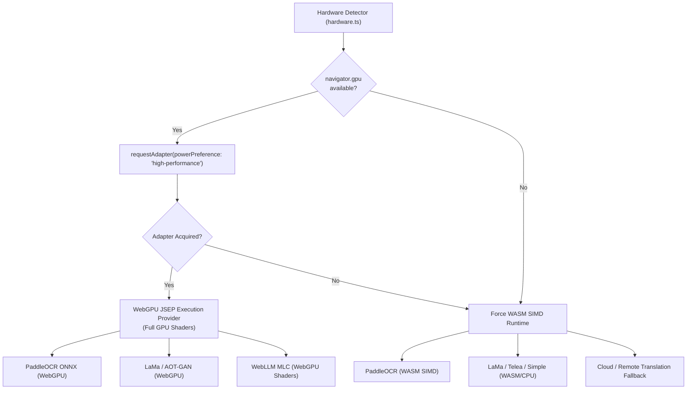
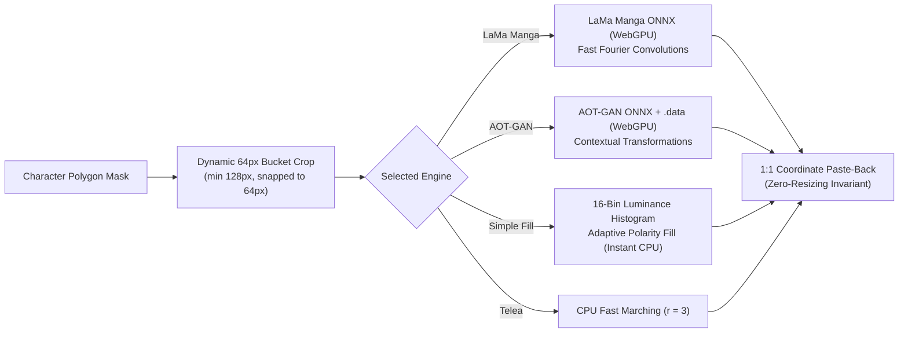
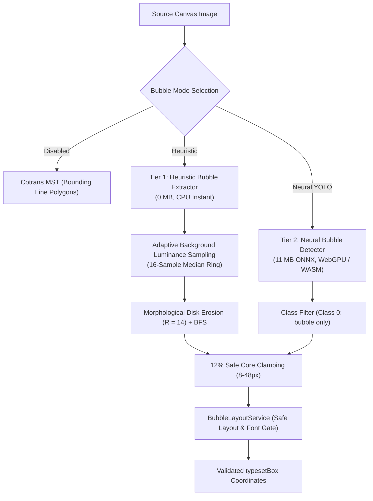

# AI Models, Runtimes & Hardware Acceleration 🧠

Kites combines modern computer vision, neural inpainting, and large language models (LLMs) to perform spatial comic translation directly in the user's browser. This document details the underlying neural architectures, execution providers, weight distribution, and cache lifecycles.

---

## 🏗️ Hardware Acceleration Matrix



### 1. WebGPU (JSEP) Execution Provider
Kites leverages **ONNX Runtime Web (`onnxruntime-web`)** with the JavaScript Execution Provider (JSEP) for WebGPU:
- Direct shader dispatch for matrix multiplications, convolutions, and attention kernels.
- Bypasses WebGL overhead and CPU round-trips.
- Preference: `powerPreference: 'high-performance'` to engage discrete GPUs on dual-GPU laptops.

### 2. WebAssembly (WASM SIMD) Fallback
If WebGPU is disabled by enterprise policy, unsupported by hardware, or encounters driver errors:
- Kites gracefully falls back to multi-threaded WASM SIMD (`ort-wasm-simd-threaded.wasm`).
- Inpainting falls back to CPU Fast Marching (Telea) or Instant Simple Fill.
- Translation switches to the Cloudflare Shared Pool or remote APIs.

---

## 👁️ Text Detection & Recognition (PaddleOCR Engine)

Kites employs an optimized TypeScript port of Baidu's **PaddleOCR (PP-OCR)** pipeline.

### 1. DBNet Scene Text Detection
- **Architecture:** Differentiable Binarization Network (DBNet) with a lightweight MobileNetV3 / Student backbone.
- **Output:** Approximate text probability map $\to$ contour extraction $\to$ unclipped quadrilateral bounding boxes (`dt_polys`).
- **Dynamic 1D Tiler:** For tall webtoons ($H \ge 2500\text{ px}$), splits images into $1000\text{ px}$ slices with $300\text{ px}$ overlap, re-projecting coordinates and deduplicating boundary polygons via IoU.

### 2. SVTR / CRNN Text Recognition
- **Architecture:** Single Visual Model for Text Recognition (SVTR) combined with Connectionist Temporal Classification (CTC) beam search.
- **Input:** Projectively rectified text crops ($32\text{ px}$ fixed height, rotated $90^\circ$ for vertical text lines).
- **Character Dictionaries:** Mapped character lookup tables (`ppocrv6_dict.txt`, `japan_dict.txt`, etc.).

### 3. OCR Registry Tiers (`ocrRegistry.ts`)

| Tier ID | Model Name | Role & Trade-offs | Detection ONNX | Recognition ONNX |
| :--- | :--- | :--- | :--- | :--- |
| `v6-small` *(Default)* | PP-OCRv6 Small | Fastest, balanced accuracy; optimal for most manga | `PP-OCRv6_small_det.onnx` | `PP-OCRv6_small_rec.onnx` |
| `v6-medium` | PP-OCRv6 Medium | Higher capacity for stylized fonts and dense pages | `PP-OCRv6_medium_det.onnx` | `PP-OCRv6_medium_rec.onnx` |
| `v6-tiny` | PP-OCRv6 Tiny | Ultra-lightweight for memory-constrained environments | `PP-OCRv6_tiny_det.onnx` | `PP-OCRv6_tiny_rec.onnx` |
| `v5-server` | PP-OCRv5 Server | High-precision server weights from v5 series | `PP-OCRv5_server_det_infer.onnx` | `PP-OCRv5_server_rec_infer.onnx` |
| `v5-en-mobile` | PP-OCRv5 English | Specialized for Latin/English comics | `PP-OCRv5_mobile_det_infer.onnx` | `en_PP-OCRv5_mobile_rec_infer.onnx` |
| `v3-multilingual` | PP-OCRv3 Multi | Cotrans v3 legacy multilingual & Japanese dictionary | `PP-OCRv3_mobile_det.onnx` | `japan_rec.onnx` |

---

## 🎨 Inpainting Models & Patch Architecture



### 1. LaMa Manga (`ogkalu/lama-manga-onnx-dynamic`)
- **Architecture:** Resolution-robust Large Mask Inpainting (LaMa) using Fast Fourier Convolutions (FFC).
- **Domain Fine-Tuning:** Trained on manga, anime line art, screentones, and speech balloon textures.
- **Dynamic 64px Patching:** Slices out the local bubble cluster, snaps dimensions to multiples of 64 ($\lceil\text{dim}/64\rceil \times 64$, minimum $128\text{ px}$), and pastes back at 1:1 pixel coordinates without resolution loss.

### 2. AOT-GAN (`Unhead/aotgan`)
- **Architecture:** Aggregated Contextual Transformations GAN.
- **Weights:** Ships split weights (`aotgan.onnx` graph + `aotgan-dynamic.onnx.data` external tensors).
- **Capability:** Reconstructs complex screentone patterns, halftone dots, and speedline backgrounds when erasing sound effects (SFX).

### 3. Simple Inpaint (Adaptive Polarity Fill)
- **Zero-Model CPU Algorithm:** Instant execution for clean dialogue bubbles.
- **16-Bin Luminance Histogram:** Evaluates interior bubble luminance to detect white vs dark bubble polarity, sampling margin pixels and flooding the character polygons with the polarity-adapted background color.

---

## 💬 Translation Engines & Large Language Models

Kites provides multiple translation tiers depending on user preference, hardware, and privacy requirements:

```mermaid
graph TD
    InputTexts["Grouped Dialogue Segments [b0...bN]"] --> Routing{"Engine Choice"}
    Routing -->|On-Device WebGPU| WebLLM["WebLLM (MLC-AI)<br/>Zero Data Leaves Browser"]
    Routing -->|Community Pool| CloudflarePool["Cloudflare Shared Pool<br/>(api.12094852.xyz)"]
    Routing -->|Zero-Setup Cloud| Google["Google Translate API"]
    Routing -->|BYOK (Own Keys)| CustomAPI["Custom API<br/>(OpenAI / Claude / Gemini)"]
```

### 1. WebLLM (On-Device WebGPU Inference)
- **Framework:** `@mlc-ai/web-llm` running TVM/Relax compiled WebGPU shaders.
- **Privacy Guarantee:** Complete on-device execution. Model weights are cached locally in the browser's Cache API / IndexedDB.
- **Supported Models:**
  - `Qwen2.5-1.5B-Instruct-q4f16_1-MLC` (Best multilingual performance for Asian languages).
  - `Llama-3.2-1B-Instruct-q4f16_1-MLC` (Strong Latin/English translation).
  - `Phi-3.5-mini-instruct-q4f16_1-MLC` (High reasoning capacity).
  - `SmolLM2-135M-Instruct-q0f16-MLC` (Ultra-lightweight test tier).

### 2. Cloudflare Shared Pool (`worker/`)
- Edge-hosted community pool with multi-provider failover:
  - **Mistral AI:** Ministral 3B.
  - **Groq:** Qwen 2.5 72B / GPT-OSS 120B.
  - **Google AI Studio:** Gemma 4 26B / 31B.
  - **Cloudflare Workers AI:** Llama 3.2 1B.

### 3. Custom API & Google Translate
- Direct user-configured endpoints supporting OpenAI GPT-4o, Anthropic Claude 3.5 Sonnet, and Google Gemini 1.5 Pro.
- Built-in Google Translate fallback for instant, zero-configuration setup.

---

## 🗨️ Speech Bubble Detection & Layout Subsystem

Kites incorporates a dual-route bubble extraction subsystem to expand narrow vertical CJK text bounding boxes into comfortable, readable horizontal chambers:



### 1. Tier 1: Heuristic Bubble Extractor (0 MB, Instant CPU)
- **Zero-Download Footprint:** Operates on offscreen canvas `ImageData` at $< 1.5\text{ ms}$ runtime per bubble.
- **Adaptive Luminance Sampling:** 16-sample median ring $4\text{ px}$ outside the text bounding box computes $L_{bg}$ and sets threshold $\text{max}(130, L_{bg} - 35)$, allowing translucent balloons to be extracted without premature cutoff.
- **Morphological Opening:** Disk erosion ($R \approx 14\text{ px}$) severs pointing tails; 4-connected BFS flood-fill recovers the main balloon chamber; constrained dilation restores true borders.
- **Leak Guard:** Bounding patch fill ratio $\ge 96\%$ in both dimensions flags unbounded page margins, falling back to tight text bounds.

### 2. Tier 2: Neural Bubble Detector (`bubble-yolo`, ~11.12 MB ONNX)
- **Model:** `ogkalu/comic-text-and-bubble-detector` (`detector-v4-s_int8.onnx`, 11,120,765 bytes).
- **Execution Provider:** WebGPU (`powerPreference: 'high-performance'`) with automated fallback to multi-threaded WASM.
- **Input Dimension:** $640 \times 640\text{ px}$.
- **Class Filtering:** Exclusively admits class `0: bubble` proposals at score threshold $\ge 0.30$. Classes `1: text_bubble` and `2: text_free` are strictly discarded to prevent OCR-like text bounding boxes from being treated as bubble containers.

### 3. Future Work: Neural Bubble Segmentation Candidate
- **Model:** `mednasserallah/manga109-segmentation-bubble-onnx` (`manga109_segmentation_bubble_1024.onnx`, 11,845,329 bytes / 11.85 MB).
- **Architecture:** YOLO11n fine-tuned on Manga109 dataset with segmentation head (1024×1024 input, opset 17).
- **Role:** Deferred research tier for direct curved mask generation and per-line text layout, bypassing axis-aligned rectangular approximations.

---

## 💾 Model Caching & Lifecycle Management

1. **Persistent Browser Cache API (`caches.open('kites-model-cache')`):**
   - ONNX model buffers (`.onnx`), external tensor blobs (`.data`), and character dictionaries (`.txt`) are cached upon first download.
   - Subsequent extension launches load models from local disk cache with zero network requests.
2. **Monotonic Progress Reporting:**
   - Background downloads emit `MODEL_DOWNLOAD_PROGRESS` events to update extension UI progress bars.
3. **Graceful Engine Eviction:**
   - When users switch OCR or Inpainting tiers in settings, the previous ONNX session or WebLLM instance is cleanly disposed of via `engine.destroy()`, releasing GPU buffers and WebGPU VRAM.
