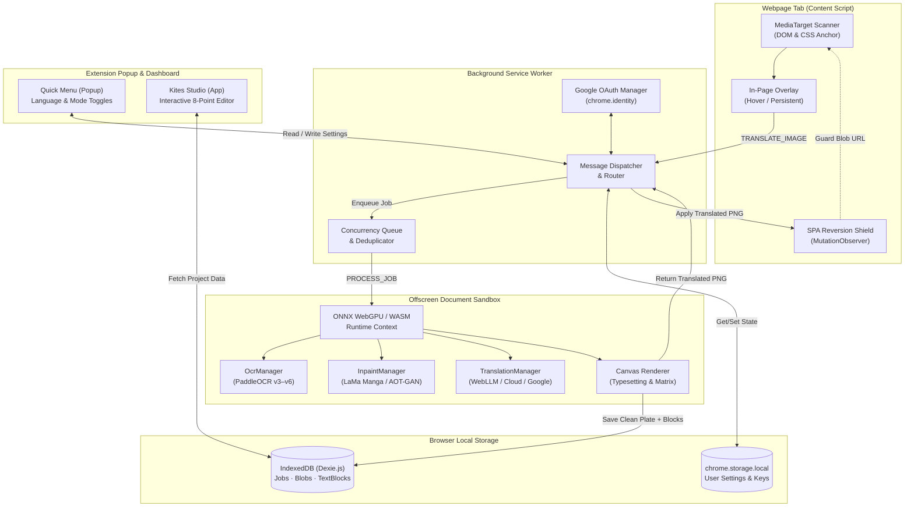

# System Architecture Overview 🏛️

Kites is built as a **Chrome Manifest V3 (MV3)** extension designed to process and translate comic images with spatial awareness while keeping computation local, private, and fast.

This document outlines the multi-tier extension architecture, runtime boundaries, communication contracts, and local storage design.

---

## 🏗️ Architectural Topology

Chrome Manifest V3 enforces strict security boundaries: service workers are ephemeral, background contexts cannot access DOM or WebGPU adapters reliably, and page scripts cannot execute untrusted code.

Kites overcomes these constraints using a four-tier architecture:

---

## 🧩 Core Runtime Components

### 1. Webpage Content Script (`src/content/`)
- **Image Discovery (`MediaTarget`):** Scans the DOM for eligible `` elements (minimum rendered dimension `150 × 150 px`). Associates hidden backing images with visible media surfaces (common on Twitter/X, Pixiv, and modern readers).
- **CSS Anchor Overlays:** Uses modern CSS Anchor Positioning to float translation action buttons directly over comic panels without breaking host page layout.
- **Single-Page Application (SPA) Reversion Shield:** Modern SPAs (React Native for Web on x.com, Reddit) frequently reconcile DOM state and wipe manually modified `src` attributes. Kites mounts a targeted `MutationObserver` (`attachReversionShield`) that:
  - Wipes `srcset` attributes (`targetImg.removeAttribute('srcset')`).
  - Converts large Base64 outputs to same-origin Blob URLs (`URL.createObjectURL(blob)`) to avoid DOM bloat and strict CSP rejections.
  - Intercepts SPA resets and immediately re-applies the translated image.
- **Self-Mutation Guard:** Wraps programmatic updates in `runSelfMutation(() => { ... })` with an `isSelfMutating` flag to prevent infinite mutation loops.

### 2. Background Service Worker (`src/background/`)
- **Ephemeral Event Hub:** Acts as the central coordination hub between content scripts, the popup UI, and the offscreen processor.
- **Job Deduplication & Concurrency:** Queues incoming translation requests. Deduplicates redundant triggers on the same image URL and enforces user-configured concurrency (1 to 5 parallel tasks).
- **Google OAuth Strategy (`src/background/auth/`):** Handles `chrome.identity.getAuthToken` flows for users connecting to the optional Cloudflare Shared Pool.
- **Normalized State Boundary:** Reads and writes `popupState` in `chrome.storage.local` with strict deep-merging against `DEFAULT_POPUP_STATE`.

### 3. Offscreen Document (`src/offscreen/`)
- **Why Offscreen?** In Manifest V3, service workers are terminated by Chromium if inactive or if an operation exceeds a few seconds. Neural inference (ONNX WebGPU shaders, LaMa inpainting, WebLLM generation) can take several seconds. Chrome's **Offscreen Document API** provides a persistent DOM environment with full WebGPU, WebAssembly, and Canvas support.
- **Orchestration (`PipelineOrchestrator.ts`):** Coordinates PaddleOCR detection, Kruskal-MST line grouping, parallel inpainting + translation, and binary-search typesetting.
- **Explicit RPC Addressing:** Because `chrome.runtime.sendMessage` broadcasts across all extension contexts, all background/offscreen communications strictly use explicit markers:
  - Popup -> Background: `target: 'background', source: 'popup', request: true`
  - Background -> Offscreen: `target: 'offscreen', source: 'background', request: true`
  - Offscreen ignores messages that do not match these criteria.

### 4. Local Database (`src/db.ts`)
- **Dexie.js on IndexedDB:** Persists full translation projects locally.
- **Separation of Concerns:**
  - `projects` table: Stores job metadata, original image blob, cleaned inpainted background blob, and structured `TextBlock[]` arrays (coordinates, OCR text, translated text, font size, color).
  - `jobs` table: Active queue status for in-flight tasks.
- **Automatic 7-Day TTL Cleanup:** On extension startup, an orphan-recovery and pruning routine automatically purges records older than 7 days to preserve user disk space.

### 5. Kites Studio (`src/App.tsx`)
- A full-screen desktop dashboard built with React 19 and Tailwind CSS 4.
- Allows users to open past jobs, inspect the clean inpainted plate, drag and resize 8-point bounding boxes, change font styles, and export 1:1 lossless PNGs.

---

## 🔒 Security & Privacy Architecture

- **No Remote Image Uploads:** Image blobs are loaded into browser memory and passed directly to local WebGPU/WASM buffers.
- **Isolated Credentials:** Custom API keys (OpenAI, Anthropic, Gemini) are stored in encrypted `chrome.storage.local` and never synchronized to external servers.
- **Content Security Policy (CSP):** `manifest.json` specifies `"script-src 'self' 'wasm-unsafe-eval'; object-src 'self'"`. No remote executable code or external script tags are permitted.
