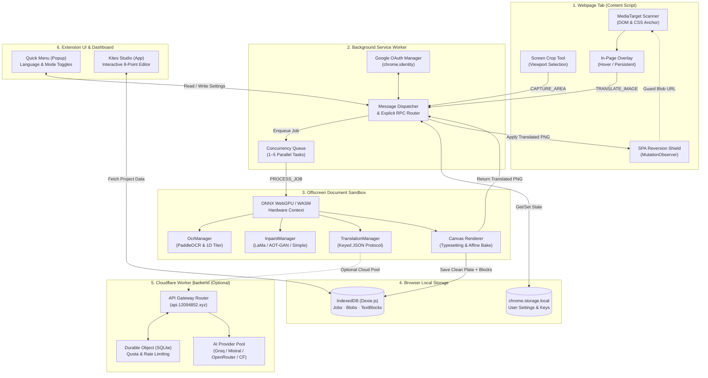

# System Architecture Overview 🏛️

Kites is built as a **Chrome Manifest V3 (MV3)** extension designed to process and translate comic images with spatial awareness while keeping computation local, private, and fast.

This document outlines the multi-tier extension architecture, runtime boundaries, communication contracts, storage schema, and supporting backend services.

---

## 🏗️ Architectural Topology

Chrome Manifest V3 enforces strict security boundaries: service workers are ephemeral, background contexts cannot access DOM or WebGPU adapters reliably, and page scripts cannot execute untrusted code.

Kites overcomes these constraints using a coordinated five-tier architecture:

```mermaid
graph TB
    subgraph BrowserTab["1. Webpage Tab (Content Script)"]
        Scanner["MediaTarget Scanner<br/>(DOM & CSS Anchor)"]
        Shield["SPA Reversion Shield<br/>(MutationObserver)"]
        ScreenCrop["Screen Crop Tool<br/>(Viewport Selection)"]
        UIButtons["In-Page Overlay<br/>(Hover / Persistent)"]
    end

    subgraph ExtensionServiceWorker["2. Background Service Worker"]
        Hub["Message Dispatcher<br/>& Explicit RPC Router"]
        Queue["Concurrency Queue<br/>(1–5 Parallel Tasks)"]
        OAuth["Google OAuth Manager<br/>(chrome.identity)"]
    end

    subgraph OffscreenDoc["3. Offscreen Document Sandbox"]
        WebGPU["ONNX WebGPU / WASM<br/>Hardware Context"]
        OcrSvc["OcrManager<br/>(PaddleOCR & 1D Tiler)"]
        InpaintSvc["InpaintManager<br/>(LaMa / AOT-GAN / Simple)"]
        TransSvc["TranslationManager<br/>(Keyed JSON Protocol)"]
        RenderSvc["Canvas Renderer<br/>(Typesetting & Affine Bake)"]
    end

    subgraph LocalStorage["4. Browser Local Storage"]
        DexieDB[("IndexedDB (Dexie.js)<br/>Jobs · Blobs · TextBlocks")]
        LocalStore[("chrome.storage.local<br/>User Settings & Keys")]
    end

    subgraph CloudflareBackend["5. Cloudflare Worker Backend (Optional)"]
        WorkerRouter["API Gateway Router<br/>(api.12094852.xyz)"]
        WorkerDO["Durable Object (SQLite)<br/>Quota & Rate Limiting"]
        ProviderPool["AI Provider Pool<br/>(Groq / Mistral / OpenRouter / CF)"]
    end

    subgraph DesktopUI["6. Extension UI & Dashboard"]
        PopupView["Quick Menu (Popup)<br/>Language & Mode Toggles"]
        StudioApp["Kites Studio (App)<br/>Interactive 8-Point Editor"]
    end

    UIButtons -->|TRANSLATE_IMAGE| Hub
    Scanner --> UIButtons
    Shield -.->|Guard Blob URL| Scanner
    ScreenCrop -->|CAPTURE_AREA| Hub

    Hub -->|Enqueue Job| Queue
    Queue -->|PROCESS_JOB| WebGPU
    Hub <-->|Get/Set State| LocalStore
    OAuth <--> Hub

    WebGPU --> OcrSvc
    WebGPU --> InpaintSvc
    WebGPU --> TransSvc
    WebGPU --> RenderSvc

    TransSvc -.->|Optional Cloud Pool| WorkerRouter
    WorkerRouter <--> WorkerDO
    WorkerRouter --> ProviderPool

    RenderSvc -->|Save Clean Plate + Blocks| DexieDB
    RenderSvc -->|Return Translated PNG| Hub
    Hub -->|Apply Translated PNG| Shield

    PopupView <-->|Read / Write Settings| Hub
    StudioApp <-->|Fetch Project Data| DexieDB
```

---

## 🧩 Core Subsystems & Runtime Contracts

### 1. Webpage Content Script (`src/content/`)
- **Universal Media Discovery (`MediaTarget`):** Scans the DOM for comic panels (minimum dimension `150 × 150 px`). Resolves complex layout wrappers:
  - Invisible backing `` layers beneath pointer overlays (Twitter/X, Pixiv).
  - SVG placeholder handling: Detects and skips inline data-URL SVG placeholders without wedging queues.
  - CSS `background-image` extraction on div-based readers.
- **CSS Anchor Positioning:** Floats translation action buttons directly over comic panels using modern CSS Anchor Positioning without mutating host page layouts.
- **Single-Page Application (SPA) Reversion Shield:** Modern reactive SPAs (React Native for Web, Vue) re-render and wipe mutated `src` attributes. Kites mounts a targeted `MutationObserver` (`attachReversionShield`):
  - Clears `srcset` attributes to prevent responsive image resets.
  - Converts large Base64 strings to same-origin Blob URLs (`URL.createObjectURL(blob)`) to avoid DOM bloat and CSP rejections.
  - Intercepts SPA re-renders and re-applies the translated image.
- **Screen Crop Translation (`ScreenCropManager`):** For protected canvas elements, WebGL viewers, or complex panels, users can draw a screen-pinned crop box (Xnip-style `position: fixed` viewport overlay) to translate arbitrary screen areas.

👉 *Detailed guide: [`docs/architecture/content-script-and-media.md`](content-script-and-media.md)*

---

### 2. Background Service Worker (`src/background/`)
- **Ephemeral Event Hub:** Mediates all messaging between content scripts, the popup UI, and the offscreen document.
- **Job Deduplication & Concurrency Queue:** Manages translation tasks, deduplicates redundant requests on the same image, and enforces configurable concurrency (1 to 5 jobs).
- **Explicit RPC Routing Contract:** Chromium broadcasts extension messages to all active contexts. To prevent cross-talk and ghost execution, every message carries explicit routing markers:
  - `target: 'background' | 'offscreen'`
  - `source: 'popup' | 'content' | 'background' | 'offscreen'`
  - `request: true`
- **Google OAuth Manager (`src/background/auth/`):** Manages `chrome.identity.getAuthToken` flows for users connecting to the Cloudflare Shared Pool.

---

### 3. Offscreen Document Sandbox (`src/offscreen/`)
- **Why Offscreen?** Manifest V3 terminates service workers after 30 seconds of inactivity or long compute runs. Neural models (ONNX WebGPU shaders, LaMa inpainting, WebLLM generation) require an un-throttled environment with DOM and GPU access. The Offscreen Document provides a persistent DOM context.
- **Hardware Acceleration (`hardware.ts`):** Probes WebGPU capability with high-performance adapter preference. Seamlessly falls back to WebAssembly (WASM SIMD) if WebGPU is unavailable or encounters driver errors.
- **Pipeline Orchestrator (`PipelineOrchestrator.ts`):** Controls the end-to-end pipeline:
  1. OCR via `OcrManager` (with 1D tiling for $h \ge 2500\text{ px}$ images).
  2. 14-stage geometric and noise filtering + Kruskal MST bubble clustering.
  3. Parallel execution of Inpainting and Translation via `Promise.all`.
  4. 4-pass binary search typesetting with affine matrix canvas baking.

👉 *Detailed guide: [`docs/architecture/pipeline.md`](pipeline.md)*

---

### 4. Local Database & Clean Plate Storage (`src/db.ts`)
- **Dexie.js on IndexedDB:** Persists full translation records locally on the user's device.
- **Clean Plate Storage Invariant:** Rather than destructively baking translated text into the stored database image, Kites saves the **raw inpainted background plate** alongside structured `TextBlock[]` arrays (coordinates, original text, translated text, font size, color, stroke).
- **Automatic 7-Day TTL Cleanup:** On startup, an orphan-recovery and garbage collection routine purges records older than 7 days to keep disk usage lean.

---

### 5. Cloudflare Zero-Cost Worker Backend (`worker/`)
- **API Gateway (`api.12094852.xyz`):** An edge-hosted translation proxy enabling shared community AI access without requiring users to purchase API keys.
- **Durable Objects with SQLite:** Enforces daily user quotas (e.g. 50 pages/day) and sliding-window rate limits per Google account.
- **Resilient Multi-Provider Waterfall:**
  $$\text{Groq} \longrightarrow \text{Mistral} \longrightarrow \text{OpenRouter} \longrightarrow \text{Cloudflare Workers AI}$$
  If one provider experiences downtime or rate limits (HTTP 429), the Worker automatically cascades to the next provider within milliseconds.

👉 *Detailed guide: [`docs/architecture/backend-worker.md`](backend-worker.md)*

---

### 6. Kites Studio & Typesetting Editor (`src/App.tsx`)
- A full-screen desktop dashboard built with React 19 and Tailwind CSS 4.
- **Interactive 8-Point Bounding Boxes:** Click any speech bubble to reposition, resize with 8 handles, edit original and translated text, adjust font families, or tweak colors.
- **Lossless PNG Export:** Exports high-resolution 1:1 comic pages with re-rendered vector typography.

👉 *Detailed guide: [`docs/architecture/studio-and-typesetting.md`](studio-and-typesetting.md)*

---

## 🔒 Security & Privacy Architecture

- **100% Local Inference Option:** When using WebLLM and local inpainting, no image or text data leaves the user's browser.
- **Zero Image Uploads to Cloud:** Even when using cloud translation, only plain extracted text strings are sent to the translation API — image blobs are never transmitted externally.
- **Encrypted Local Storage:** User API keys (OpenAI, Anthropic, Gemini) are stored in `chrome.storage.local` and never synced across devices.
- **Strict Content Security Policy (CSP):** `manifest.json` specifies `"script-src 'self' 'wasm-unsafe-eval'; object-src 'self'"`. No external CDN scripts or remote code execution are permitted.
