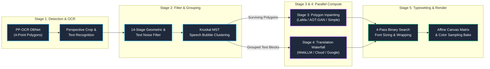

# Translation Pipeline & Algorithm Guide 📐

This document provides a comprehensive technical walkthrough of Kites' 5-stage translation pipeline.

> 💡 **Want to explore interactively?** Open [`docs/workflow.html`](../workflow.html) for an explorable architecture diagram with inspectable parameters and formula cards.

---

## 🔄 The 5-Stage Processing Pipeline

---

## 🔍 Detailed Algorithmic Breakdown

### Stage 1: Text Detection & Recognition (`OcrManager.ts`)
1. **DBNet Detection:**
   - Input image is dynamically resized with maximum dimension clamped to `960 px` (maintaining exact aspect ratio).
   - DBNet outputs a probability map; pixels with probability $\ge 0.3$ are binarized.
   - Connected components with contour area $\ge 15\text{ px}$ are extracted as convex hulls (`dt_polys`).
   - Blobs are filtered with confidence score $\ge 0.5$ and expanded using `UNCLIP_RATIO = 1.5`.
2. **Projective Homography & Recognition:**
   - Text polygon bounding quadrilaterals are projectively warped to rectangular image patches using bicubic sampling.
   - For vertical text strips ($\text{height} / \text{width} \ge 1.5$), the crop is rotated 90° counter-clockwise before entering the CRNN/SVTR recognition network.
   - CTC beam search decodes character indices using language-specific character dictionaries.

---

### Stage 2: Geometric Noise Filtering & Kruskal-MST Grouping (`CustomPaddleDetector.ts`)

To eliminate watermarks, manga speedlines, sound effects (SFX), and scanlator credits without destroying dialogue, Kites executes a 14-stage filtering and grouping battery:

#### 1. Geometric & Noise Battery (Stages 1–14)
- **Geometry Guards:** Rejects stray micro-boxes ($<10\text{ px}$), giant panel-filling artifacts ($\ge 60\%$ page width and $\ge 120\text{ px}$ height), extreme tilts ($>12^\circ$), and slivers stuck directly on page margins ($\le 5\text{ px}$).
- **Text Debris Filtering:** Strips punctuation-only noise, low-confidence single ASCII characters, and scanlator URL watermarks.
- **Furigana Suppression:** Characters running parallel to main kanji text with font size $<0.45\times$ of the parent line are classified as Furigana reading aids and filtered out.
- **Deduplication:** Merges nested or duplicate detections with $\ge 50\%$ bounding box overlap.

#### 2. Spatial Bubble Clustering (Cotrans Kruskal-MST)
- **Direction Graph:** Measures spatial gaps, character spacing, alignment ratios, and aspect tolerances to classify text as horizontal or vertical.
- **Complete Weighted Graph:** Lines within the same panel are represented as vertices with edge weights equal to spatial Euclidean distance between line centroids.
- **Kruskal's Algorithm:** Computes the Minimum Spanning Tree (MST). If the maximum edge in the tree satisfies:
  $$\text{weight}_{\max} \le \mu + 2\sigma \quad \text{or} \quad \text{weight}_{\max} \le 1.5 \times \text{fontSize}$$
  the cluster forms a single unified speech balloon. Otherwise, the longest edge is cut and clustering recurses.
- **Reading Order Assembly:** Lines inside a cluster are sorted top-to-bottom (horizontal) or right-to-left (vertical) to produce natural sentence flow.

---

### Stage 3: Polygon-Strict Inpainting (`InpaintManager.ts`)

> ⚠️ **Core Architectural Contract:** Inpainting engines receive **only surviving character polygon masks**, never full speech-bubble bounding rectangles or raw DBNet probability masks. This prevents the accidental erasure of background art, screen tones, and balloon boundaries.

1. **Simple Fill (Instant CPU):**
   - Samples pixels in an expanded margin around the polygon contour.
   - Computes the median RGB color for luminance $\ge 180$ (typical speech bubble interior) and floods the polygon.
2. **Telea Diffusion (CPU Fast Marching):**
   - Uses local fast-marching diffusion with radius $r = 3$ to smoothly bridge complex gradients.
3. **LaMa Manga & AOT-GAN (WebGPU Dynamic Patching):**
   - **Dynamic 64px Bucketing:** Rather than downsampling full pages to 512×512 (which causes blur and gray box artifacts), Kites crops tightly around the text bubble and snaps width/height to multiples of 64 ($\lceil\text{dim} / 64\rceil \times 64$).
   - **Zero-Resizing Invariant:** Maintains 1:1 pixel coordinates between the crop and paste buffer.
   - **Stroke Expansion:** Masks are rendered with `lineWidth = 4` (`lineJoin = 'round'`) to ensure anti-aliased character edges are completely covered.

---

### Stage 4: Index-Safe Translation Waterfall (`TranslationManager.ts`)

Translation runs concurrently with inpainting via `Promise.all`:

1. **Delimiter Indexing:**
   - Text blocks are packed with indexed markers (`⟦0⟧ dialogue ⟦1⟧ narration`) to maintain 1:1 line alignment through remote translation APIs.
2. **Waterfall Fallback Chain:**
   - If an engine encounters network failure, rate limiting (HTTP 429), or quota exhaustion, Kites falls back through the configured chain:
     $$\text{Primary Engine} \longrightarrow \text{Fallback Tier 1} \longrightarrow \text{Fallback Tier 2}$$
   - **Engines:**
     - **WebLLM:** Local WebGPU inference using MLC WebLLM (Llama 3.2, Qwen 2.5, Phi-3.5).
     - **Cloud Shared Pool:** Cloudflare Worker backend with Google OAuth quota management and provider fallback (Mistral 3B $\to$ Gemma 4 $\to$ Groq $\to$ OpenRouter $\to$ Cloudflare Workers AI).
     - **Google Translate:** Zero-setup default batching up to 1800 characters.
     - **Custom API:** User-provided keys for OpenAI, Anthropic Claude, or Google Gemini.

---

### Stage 5: Binary-Search Typesetting & Affine Rendering (`typesetLayout.ts`)

1. **4-Pass Font Search:**
   - **Pass 1 (Binary Fit):** Binary searches font size between $6\text{ px}$ and bubble maximum height until text fits within a 5% inner margin.
   - **Pass 2 (Tall-Box Aspect Cap):** When bubble aspect ratio $H / W \ge 2.0$, clamps font size to prevent narrow balloons from inflating fonts excessively.
   - **Pass 3 (Hyphenation Scan):** For Latin text with words $\ge 7$ characters in tall bubbles ($H / W \ge 1.5$), applies multi-stage hyphenation (`hypher`) to eliminate awkward single-word line overflows.
   - **Pass 4 (Floor Fallback):** Decrements down to the absolute $6\text{ px}$ readability floor if constraints cannot be met.
2. **Balanced Line Wrapping:**
   - Greedy line count $N$ is established $\to$ a secondary binary search finds the minimum bounding width that preserves $\le N$ lines $\to$ produces an aesthetic centered diamond or inverted-pyramid stanza.
3. **Decollision & Matrix Canvas Placement:**
   - Neighboring text boxes are checked for overlap; bounding boxes are padded and shifted to prevent text collisions.
   - Rotated text regions ($\text{angle} \ge 3^\circ$) are positioned using 2D affine transformation matrices (`ctx.setTransform`).
