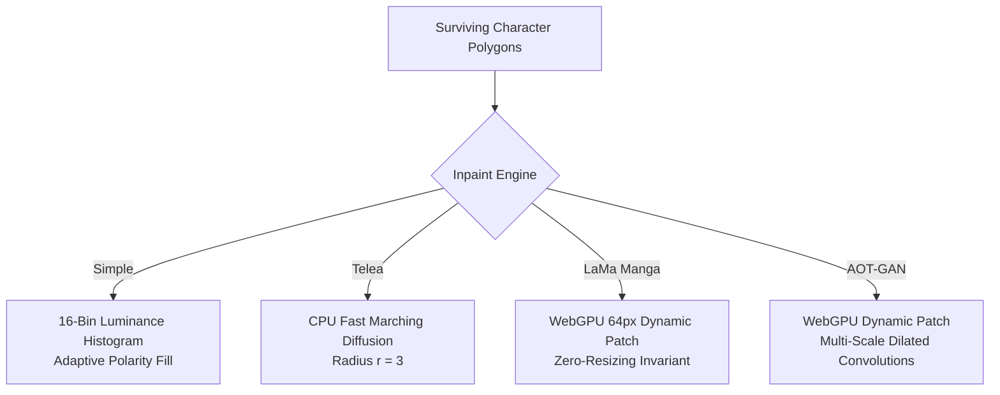
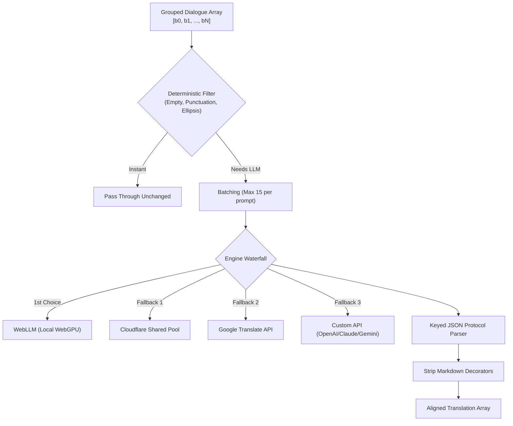
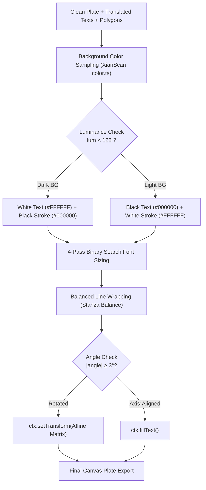

# Translation Pipeline & Algorithm Guide 📐

This document provides a comprehensive technical walkthrough of Kites' 5-stage spatial comic translation pipeline.

> 💡 **Want to explore interactively?** Open [`docs/workflow.html`](../workflow.html) for an explorable architecture diagram with inspectable parameters and formula cards.

---

## 🔄 The 5-Stage Processing Pipeline


```mermaid
flowchart LR
    classDef stage fill:#1e293b,stroke:#38bdf8,stroke-width:2px,color:#fff;
    classDef branch fill:#1e293b,stroke:#a855f7,stroke-width:2px,color:#fff;
    classDef out fill:#1e293b,stroke:#10b981,stroke-width:2px,color:#fff;

    subgraph S1["Stage 1: Detection & OCR"]
        Tiling["1D Vertical Tiler<br/>(h ≥ 2500px, 1000/700/300)"]:::stage
        DBNet["PP-OCR DBNet<br/>(4-Point Polygons)"]:::stage
        WarpRec["Projective Crop &<br/>Text Recognition"]:::stage
    end

    subgraph S2["Stage 2: Filter & Grouping"]
        Noise14["14-Stage Geometric &<br/>Text Noise Filter"]:::stage
        KruskalMST["Kruskal MST<br/>Speech Bubble Clustering"]:::stage
        ReadingOrder["Language-Aware<br/>Panel Reading Order"]:::stage
    end

    subgraph S3["Stage 3 & 4: Parallel Compute"]
        direction TB
        InpaintBranch["Stage 3: Polygon Inpainting<br/>(LaMa 64px / AOT-GAN / Simple Hist)"]:::branch
        TransBranch["Stage 4: Translation Waterfall<br/>(Keyed JSON: WebLLM / Cloud / Google)"]:::branch
    end

    subgraph S5["Stage 5: Typesetting & Render"]
        ColorSample["Background Color Sampling<br/>(Luminance Black/White Contrast)"]:::out
        BinaryFit["4-Pass Binary Search<br/>Font Sizing & Balanced Wrap"]:::out
        MatrixBake["Affine Canvas Matrix<br/>& Final Plate Export"]:::out
    end

    Tiling --> DBNet
    DBNet --> WarpRec
    WarpRec --> Noise14
    Noise14 --> KruskalMST
    KruskalMST --> ReadingOrder
    ReadingOrder -->|Surviving Polygons| InpaintBranch
    ReadingOrder -->|Grouped Text Blocks| TransBranch
    InpaintBranch --> ColorSample
    TransBranch --> ColorSample
    ColorSample --> BinaryFit
    BinaryFit --> MatrixBake
```

---

## 🔍 Detailed Algorithmic Breakdown

### Stage 1: Text Detection & Recognition (`OcrManager.ts` & `PaddleOcrEngine.ts`)

#### 1. Automatic 1D Vertical Tiling for Tall Webtoons
Modern webtoons (Naver, Kakao, Webtoon, Bilibili) are rendered as tall stitched image strips often reaching 10,000–30,000 pixels in height. Processing these full-canvas causes GPU memory crashes or squashes aspect ratios into illegibility.

When an image height exceeds `2500 px` ($H \ge 2500$), Kites activates **1D in-memory canvas tiling**:
- **Tile Dimensions:** Sliding window of height $H_{\text{tile}} = 1000\text{ px}$ with step size $S = 700\text{ px}$, creating an overlap zone of $300\text{ px}$.
- **Local OCR Inference:** Each slice is cropped onto a reusable offscreen canvas and recognized independently.
- **Coordinate Re-projection:** Polygon coordinates $(x, y)$ are projected back to full-page coordinates by adding the tile's vertical offset $Y_{\text{offset}}$.
- **IoU Boundary Deduplication:** Polygons in the overlap zone are matched using Intersection-over-Union ($\text{IoU} \ge 0.40$). The instance with higher recognition confidence is retained.

#### 2. DBNet Text Detection
- **Dynamic Dimension Scaling:** Slices are normalized with maximum dimension clamped to $960\text{ px}$ while preserving aspect ratio.
- **Probability Map & Binarization:** DBNet produces an approximate segmentation map. Pixels with probability $\ge 0.3$ are binarized.
- **Polygon Extraction (`dt_polys`):** Connected components with contour area $\ge 15\text{ px}^2$ are extracted as convex hull quadrilaterals.
- **Unclipping:** Contours are expanded using the Vatti polygon clipping algorithm with:
  $$\text{Distance} = \frac{\text{Area} \times (1 - r^2)}{\text{Perimeter}}, \quad r = 1.5$$

#### 3. Projective Homography & CTC Recognition
- **Bicubic Perspective Warp:** Rotated text bounding boxes $[p_0, p_1, p_2, p_3]$ are projectively warped to standard horizontal rectangular matrices.
- **Vertical Text Strip Detection:** For vertical scripts ($\text{height} / \text{width} \ge 1.5$), crops are rotated $90^\circ$ counter-clockwise.
- **CTC Beam Search Decoding:** Recurrent SVTR/CRNN networks decode character indices using language-specific dictionaries (`ppocrv6_dict.txt`, `japan_dict.txt`, etc.).

---

### Stage 2: Geometric Filtering & Kruskal-MST Grouping (`OcrManager.ts` & `textCleaning.ts`)

Raw OCR detection contains noise from artwork cross-hatching, screentones, watermark URLs, and sound effects. Kites runs a multi-stage filtering and grouping pipeline ported from Cotrans and XianScan.

#### 1. The 14-Stage Noise Filtering Battery
1. **Micro-Box Rejection:** Drops boxes with width or height $< 10\text{ px}$ unless high-confidence dialogue.
2. **Page-Spanning Artifact Rejection:** Eliminates boxes spanning $\ge 60\%$ of total page width and $\ge 120\text{ px}$ height (borders, frames, panels).
3. **Extreme Tilt Filter:** Drops boxes rotated beyond $12^\circ$ unless tagged as intentional angled speech.
4. **Margin Sliver Filter:** Drops slivers adhering strictly to the canvas boundary ($\le 5\text{ px}$ from page edge).
5. **Thought-Bubble Tail Filter:** Rejects repeating circles (`0oO○●⊙◯`) generated by OCR attempting to read bubble tails.
6. **Pure Punctuation & Dots:** Strips isolated ellipsis and particle rows (`...`, `---`, `‥`).
7. **Standalone Digit Noise:** Rejects random isolated numbers that fail dialogue plausibility checks.
8. **Scanlator Watermarks:** Regex filtering for scanning groups, release URLs, Discord links, and scanlation credit signatures (`colamanga`, `baozimh`, `bilibili`, `discord.gg`, `patreon`).
9. **Trailing Watermark Debris Stripping:** Strips scanlation website suffixes appended to dialogue lines (e.g. `别吵！colamanga.com` $\to$ `别吵！`) and rescales polygon bounds proportionally.
10. **Speedline & Action Stroke Filter:** Eliminates single-stroke CJK radicals and line art misidentified as text (`一`, `丨`, `丶`, `─`, `│`, `|`, `二`).
11. **Furigana Reading Aid Suppression:** Suppresses ruby/furigana characters running parallel to main dialogue lines where font size is $< 0.45\times$ of the parent text.
12. **Duplicate & Containment Deduplication:** When two detections have $\ge 50\%$ bounding box overlap, preserves the longer text slice or higher confidence read.
13. **Low-Confidence Standalone Latin Filter:** In CJK pages, purges stray isolated Latin noise strings below confidence thresholds while preserving genuine English loanwords.
14. **Action SFX Exemption:** Protects genuine onomatopoeia and shouts (`哒嗒啪轰`, `쾅쿵`, `ah`, `boom`) from being misfiltered by short-line rules.

#### 2. Spatial Bubble Clustering (Kruskal Minimum Spanning Tree)
Multiple lines in a single speech bubble must be grouped into one coherent text region:
- **Direction Determination:** Evaluates line aspect ratio and structure midpoints to determine horizontal (`h`) vs vertical (`v`) direction.
- **Proximity Graph:** Evaluates spatial distance between line boundaries using Cotrans `quadrilateral_can_merge_region`:
  - Font size ratio tolerance: $\le 2.0$
  - Aspect ratio tolerance: $\le 1.3$
  - Character gap tolerance: $1.0\times$ font size along text flow, $3.0\times$ perpendicular.
- **Kruskal MST Splitting:** For candidate graph components, builds a Minimum Spanning Tree over line centroids. Slices edges exceeding standard deviation bounds:
  $$\text{weight}_{\max} > \mu + 2\sigma \quad \text{and} \quad \text{weight}_{\max} > 1.5 \times \text{fontSize}$$
- **Intra-Bubble Line Ordering:**
  - Horizontal bubbles (`h`): Centroid $Y$ ascending (top-to-bottom).
  - Vertical bubbles (`v`): Centroid $X$ descending (right-to-left).
  - Concatenation: Joins CJK characters without spacing; inserts spaces for Latin/Cyrillic.

#### 3. Language-Aware Panel Reading Order (`isRightToLeftReadingOrder` & Cotrans `sort_regions`)
After clustering, bubbles across the entire page must be sequenced logically so the LLM receives dialogue in chronological reading order:
- **Language-Aware Direction Classification:**
  - **Japanese Manga (`ja`):** Strictly Right-to-Left (RTL).
  - **Arabic / Hebrew (`ar`, `he`, `fa`, `ur`):** Strictly Right-to-Left (RTL).
  - **Chinese Manhua (`zh`, `zh-TW`, `zh-HK`, `zh-CN`):**
    - Vertical bubbles predominate ($v_{\text{count}} > 0$ and $v_{\text{count}} \ge h_{\text{count}}$): **Right-to-Left (RTL)** (traditional print, HK & Taiwan manhua).
    - Horizontal bubbles predominate: **Left-to-Right (LTR)** (modern digital webtoons).
  - **Western / Korean / Vietnamese (`en`, `ko`, `vi`, etc.):** Left-to-Right (LTR).
  - **Auto Fallback:** Checks for Japanese Kana characters (RTL) or predominant vertical text (RTL); otherwise defaults to LTR.
- **Row-Band Insertion Sort:**
  1. Bubbles are pre-sorted by vertical centroid $Y$ ascending.
  2. For bubbles sharing the same row band (within vertical overlap tolerance):
     - RTL: Bubble with greater $X$ (right) is placed first.
     - LTR: Bubble with smaller $X$ (left) is placed first.

---

### Stage 3: Polygon-Strict Inpainting (`InpaintManager.ts`)

> ⚠️ **Core Architectural Contract:** Inpainting engines receive **only surviving character polygon masks**, never full speech-bubble bounding rectangles or raw DBNet probability masks. This prevents the accidental erasure of background art, screen tones, and balloon boundaries.


```mermaid
graph TD
    Mask[Surviving Character Polygons] --> Choice{Inpaint Engine}
    Choice -->|Simple| Simple[16-Bin Luminance Histogram<br/>Adaptive Polarity Fill]
    Choice -->|Telea| Telea[CPU Fast Marching Diffusion<br/>Radius r = 3]
    Choice -->|LaMa Manga| LaMa[WebGPU 64px Dynamic Patch<br/>Zero-Resizing Invariant]
    Choice -->|AOT-GAN| AOT[WebGPU Dynamic Patch<br/>Multi-Scale Dilated Convolutions]
```

1. **Simple Inpaint (Adaptive Polarity Fill):**
   - Computes a 16-bin luminance histogram of the interior patch.
   - Detects background polarity: light balloon ($\text{luminance} \ge 128$) vs dark balloon / inverted night panel ($\text{luminance} < 128$).
   - Samples margin pixels around each character polygon and floods with the polarity-adapted background color.
2. **Telea Inpaint (CPU Fast Marching):**
   - Local CPU diffusion with radius $r = 3$ to reconstruct complex gradients without requiring neural weights.
3. **LaMa Manga & AOT-GAN (Neural Dynamic Patching):**
   - **Dynamic 64px Bucketing:** Rather than squashing the entire page to $512\times 512$ (which destroys resolution and produces gray artifacts), crops tightly around character clusters and snaps dimensions to multiples of 64 ($\lceil\text{dim} / 64\rceil \times 64$, minimum $128\text{ px}$).
   - **Zero-Resizing Invariant:** Retains 1:1 pixel coordinates between the crop and canvas paste-back.
   - **Mask Dilation:** Renders polygon masks with `lineWidth = 4` and `lineJoin = 'round'` to cleanly envelope anti-aliased character edges.

---

### Stage 4: Keyed JSON Translation Waterfall (`BaseLlmTranslationEngine.ts`)

Translation runs concurrently with inpainting via `Promise.all`:


```mermaid
flowchart TD
    RawTexts["Grouped Dialogue Array<br/>[b0, b1, ..., bN]"] --> FilterPassthrough{"Deterministic Filter<br/>(Empty, Punctuation, Ellipsis)"}
    FilterPassthrough -->|Instant| ReturnSame["Pass Through Unchanged"]
    FilterPassthrough -->|Needs LLM| Batching["Batching (Max 15 per prompt)"]
    Batching --> Waterfall{"Engine Waterfall"}
    Waterfall -->|1st Choice| WebLLM["WebLLM (Local WebGPU)"]
    Waterfall -->|Fallback 1| CloudPool["Cloudflare Shared Pool"]
    Waterfall -->|Fallback 2| Google["Google Translate API"]
    Waterfall -->|Fallback 3| CustomAPI["Custom API (OpenAI/Claude/Gemini)"]
    Waterfall --> JSONParser["Keyed JSON Protocol Parser"]
    JSONParser --> CleanFormatting["Strip Markdown Decorators"]
    CleanFormatting --> TranslatedArray["Aligned Translation Array"]
```

#### 1. Keyed JSON Protocol
Historical delimiter tagging (`⟦0⟧ dialogue ⟦1⟧`) suffered from model delimiter hallucination, dropped brackets, and delimiter collisions. Kites implements the **Keyed JSON Protocol**:
- Text segments are structured into a numbered JSON payload:
  ```json
  {
    "b0": "What is that over there?",
    "b1": "I don't know, be careful!"
  }
  ```
- **Strict Output Schema:** Enforces identical keys in output (`{"b0": "...", "b1": "..."}`).
- **Positional Integrity:** Prevents line loss, unnumbered mergers, and output misalignment.

#### 2. Deterministic Passthroughs & Batching
- Punctuation-only lines, ellipses, and empty strings bypass the LLM and resolve immediately.
- Batches are clamped to `DEFAULT_LLM_BATCH_SIZE = 15` segments to prevent small on-device models from dropping lines.

#### 3. Resilient Waterfall Fallback Chain
If the primary translation engine fails (rate limit, out of memory, network drop), Kites automatically falls back through the user's configured chain:
$$\text{WebLLM} \longrightarrow \text{Cloudflare Shared Pool} \longrightarrow \text{Google Translate} \longrightarrow \text{Custom API}$$

---

### Stage 5: Typesetting & Affine Rendering (`canvasTypesetting.ts` & `cotransDefaultRenderer.ts`)


```mermaid
flowchart TD
    Inputs["Clean Plate + Translated Texts + Polygons"] --> ColorSample["Background Color Sampling (XianScan color.ts)"]
    ColorSample --> ContrastDecision{"Luminance Check<br/>lum < 128 ?"}
    ContrastDecision -->|Dark BG| WhiteText["White Text (#FFFFFF) + Black Stroke (#000000)"]
    ContrastDecision -->|Light BG| BlackText["Black Text (#000000) + White Stroke (#FFFFFF)"]
    WhiteText --> BinarySearch["4-Pass Binary Search Font Sizing"]
    BlackText --> BinarySearch
    BinarySearch --> BalancedWrap["Balanced Line Wrapping (Stanza Balance)"]
    BalancedWrap --> AngleCheck{"Angle Check<br/>|angle| ≥ 3°?"}
    AngleCheck -->|Rotated| AffineMatrix["ctx.setTransform(Affine Matrix)"]
    AngleCheck -->|Axis-Aligned| StandardDraw["ctx.fillText()"]
    AffineMatrix --> FinalBake["Final Canvas Plate Export"]
    StandardDraw --> FinalBake
```

#### 1. Background Color Sampling (XianScan `color.ts` Port)
Before drawing text, Kites inspects the local pixel neighborhood around the bubble polygon:
- Samples RGB values outside the text polygon but inside the speech bubble boundary.
- Calculates perceived luminance:
  $$Y = 0.299R + 0.587G + 0.114B$$
- **Automatic Contrast Selection:**
  - $Y < 128$ (Dark panel or black speech bubble): Renders **White text** (`#FFFFFF`) with **Black stroke** (`#000000`).
  - $Y \ge 128$ (Standard white paper / light balloon): Renders **Black text** (`#000000`) with **White stroke** (`#FFFFFF`).

#### 2. 4-Pass Binary Search Typography Layout
1. **Pass 1 (Binary Search Fitting):** Binary searches font size between $6\text{ px}$ and the maximum bubble height until text wraps within an inner safety padding.
2. **Pass 2 (Tall-Box Aspect Cap):** When bubble aspect ratio $H / W \ge 2.0$, caps font size to prevent narrow speech balloons from producing oversized text.
3. **Pass 3 (Hyphenation Scan):** For Latin text containing long words ($\ge 7$ characters) in narrow balloons, invokes algorithmic hyphenation to eliminate awkward single-word line overflows.
4. **Pass 4 (Readability Floor):** Enforces a minimum $6\text{ px}$ font size floor.

#### 3. Balanced Stanza Wrapping
Greedy wrapping creates awkward hanging words. Kites finds the minimum bounding width that preserves the optimal line count $N$, shaping dialogue into an aesthetically balanced inverted pyramid or diamond stanza.

#### 4. Affine Matrix Placement
For angled speech bubbles ($|\theta| \ge 3^\circ$), text is rendered through a 2D affine transformation matrix:
```ts
ctx.translate(centerX, centerY);
ctx.rotate(angleRad);
// Draw centered text lines
ctx.setTransform(1, 0, 0, 1, 0, 0); // Restore identity matrix
```
The resulting canvas is baked into a lossless PNG Data URL and returned to the webpage content script.
