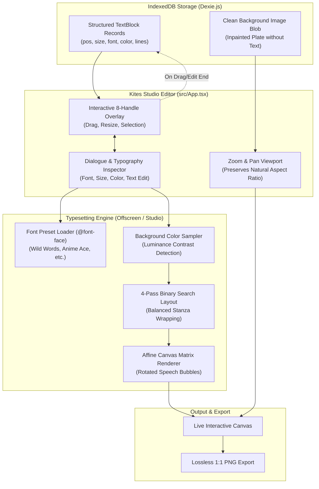

# Studio Editor & Typesetting Architecture 🎨

The **Kites Studio** (`src/App.tsx`) and **Typesetting Engine** (`src/offscreen/utils/canvasTypesetting.ts`, `typesetLayout.ts`, `cotransDefaultRenderer.ts`) provide an interactive desktop environment for reviewing comic translations, editing dialogue, adjusting typography, and exporting publication-ready comic pages.

---

## 🏗️ Architectural Topology



---

## 🧩 Clean Plate Storage & Non-Destructive Editing

Traditional translation tools destructively burn translated text into the image, making it impossible to fix typos or adjust layout after the pipeline completes.

Kites adopts a **Clean Plate Architecture**:
1. **Separation of Background and Text:**
   - The database persists `translatedImageBlob` as a **clean inpainted background plate** (character text erased, artwork reconstructed).
   - Dialogue data is persisted independently as an array of `TextBlock` records:
     ```ts
     export interface TextBlock {
       id?: number;
       imageId: number;
       originalText: string;
       translatedText: string;
       posX: number;
       posY: number;
       width: number;
       height: number;
       fontSize: number;
       fontFamily: string;
       color: string;
       strokeColor?: string;
       direction?: 'h' | 'v';
       lines?: string[];
     }
     ```
2. **Infinite Re-Typesetting:**
   Because text is rendered dynamically over the clean background, users can change fonts, resize speech bubbles, adjust colors, or retranslate text without degrading the underlying artwork.
3. **Zero-Migration `typesetBox` Studio Parity:**
   When speech bubble expansion is enabled, `posX, posY, width, height` in `db.textBlocks` are set directly to the validated expanded `typesetBox` coordinates rather than the narrow raw OCR bounding box. This guarantees 100% WYSIWYG parity between the baked in-page translation and the Studio desktop editor without requiring any Dexie schema migration.

---

## 📐 Interactive 8-Handle Bounding Box Manipulation

In Kites Studio, each speech balloon is represented as an interactive bounding box overlay:

### 1. 8-Directional Resize Handles
Users can interact with 8 distinct resize anchors:
$$\text{Handles} = \{\text{n}, \text{s}, \text{e}, \text{w}, \text{nw}, \text{ne}, \text{se}, \text{sw}\}$$
- Dragging a corner handle scales both width and height simultaneously.
- Dragging an edge handle adjusts a single dimension while clamping opposite edges.

### 2. Viewport-to-Canvas Coordinate Normalization
User pointer interactions take place in viewport CSS pixels, which vary with zoom level and pan offsets. Kites normalizes pointer coordinates to the image's original native pixels:
$$X_{\text{natural}} = \frac{X_{\text{pointer}} - X_{\text{pan}}}{\text{Scale}}$$
$$Y_{\text{natural}} = \frac{Y_{\text{pointer}} - Y_{\text{pan}}}{\text{Scale}}$$

### 3. Live Layout Reflow & Auto-Persistence
- As bounding boxes are resized in real time, the typesetting engine immediately reflows text to preview wrapping.
- When the pointer is released (`pointerup`), updated coordinates and font dimensions are automatically persisted to Dexie IndexedDB.

---

## 🔤 Typography & Font Preset System (`renderFontPresets.ts`)

Kites includes an extensible font registry tailored for manga and comics lettering:

| Preset ID | Family Label | Typographic Role | Primary Font Stack |
| :--- | :--- | :--- | :--- |
| `standard` | Standard | Clean modern sans-serif | `sans-serif` |
| `comic` | Wild Words | Classic manga dialogue | `"Kites Comic", "Wild Words", cursive, sans-serif` |
| `anime-ace`| Anime Ace | Shonen action lettering | `"Anime Ace 2.0 BB", "Anime Ace", cursive` |
| `comic-hand`| Comic Hand | Informal handwriting / small caps | `"Patrick Hand SC", "Comic Sans MS", cursive` |
| `serif` | Serif | Literary prose & narration boxes | `Georgia, "Times New Roman", serif` |
| `monospace` | Monospace | Digital screens & system messages | `"Courier New", Courier, monospace` |

### Font Loading Invariant
Before executing text measurement on canvas, the engine awaits font readiness:
```ts
if (typeof document !== 'undefined' && document.fonts) {
  await document.fonts.ready;
}
```
This guarantees that `ctx.measureText` reflects real glyph metrics rather than system fallback widths.

---

## 🎨 Background Color Sampling & Contrast Preservation

Comic text appears on diverse backgrounds: bright white speech balloons, dark nighttime panels, or screaming black spiky balloons. Hardcoding black-on-white text destroys dark panels.

Kites ports XianScan's **color sampling algorithm** (`textColor.ts`):
1. **Sampling Ring:** Samples pixels in a narrow band outside the text polygon but inside the speech bubble perimeter.
2. **Perceived Luminance Formula:**
   $$Y = 0.299R + 0.587G + 0.114B$$
3. **Contrast Decision:**
   - **Light Background ($Y \ge 128$):** Primary text `#000000` (black) with `#FFFFFF` (white) outline stroke.
   - **Dark Background ($Y < 128$):** Primary text `#FFFFFF` (white) with `#000000` (black) outline stroke.
4. **Stroke Padding:** Text outlines are rendered with `lineWidth = \max(2, \text{fontSize} \times 0.15)$ using `lineJoin = 'round'` to prevent text collisions with screentones.

---

## 📐 4-Pass Binary Search Typesetting Layout

To fill irregularly shaped comic speech balloons without overflowing, Kites runs an iterative layout engine:

1. **Pass 1 (Binary Fit):** Binary searches font size between $6\text{ px}$ and the balloon height until all lines wrap within safety margins.
2. **Pass 2 (Tall-Box Aspect Cap):** When balloon aspect ratio $H / W \ge 2.0$, clamps font size to prevent narrow speech bubbles from blowing up font sizes unnaturally.
3. **Pass 3 (Hyphenation Scan):** Uses `hypher` with language hyphenation patterns to break words $\ge 7$ characters across lines in narrow balloons, preventing single-word line overflows.
4. **Pass 4 (Readability Floor):** Enforces a minimum $6\text{ px}$ floor to guarantee legible text.
5. **Balanced Stanza Wrapping:** Evaluates multiple wrapping options to balance line lengths into an inverted pyramid or centered diamond stanza.
6. **2D Affine Transformation:** For balloons tilted by $|\theta| \ge 3^\circ$, text is drawn through affine rotation matrices (`ctx.translate`, `ctx.rotate`).

---

## 📤 High-Resolution Lossless Export

Kites Studio renders directly onto a hidden full-resolution `OffscreenCanvas`:
1. Renders the clean inpainted background bitmap at 100% scale.
2. Renders each `TextBlock` using vector canvas primitives (`fillText`, `strokeText`, `setTransform`).
3. Encodes the result as a lossless `image/png` blob.
4. Triggers automatic browser download or copies the bitmap directly to the system clipboard.
