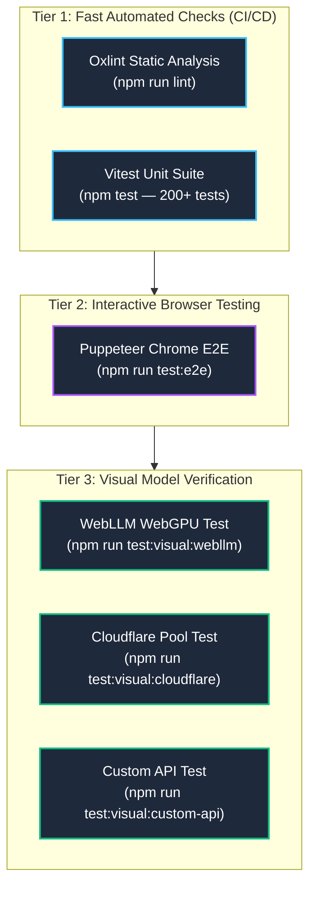

# Testing & Verification Guide 🧪

Kites enforces a strict multi-tier testing strategy to ensure that background workers, neural models, spatial clustering algorithms, and browser overlays remain robust across Chromium releases.

---

## 🏗️ Testing Strategy Overview



---

## ⚡ Tier 1: Automated Unit Tests (`npm test`)

Unit tests run via **Vitest** under `src/` and complete in under 5 seconds:

```bash
npm test
```

### What is tested:
- **Backend Orchestrators:** Translation waterfall failover logic, circuit breaking, token-bucket rate limiting, and Delimiter formatting (`TranslationManager.test.ts`).
- **Spatial Clustering Math:** Kruskal's MST algorithm, Euclidean distance thresholds, direction majority scoring, and convex hull overlap logic.
- **Typesetting Heuristics:** 4-pass font fitting bounds, hyphenation triggers, tall-box aspect ratio clamping, and decollision matrix math.
- **Database & Queue Lifecycle:** Dexie.js IndexedDB schema migrations, orphan job cleanup, and 7-day TTL pruning.

---

## 🌐 Tier 2: Interactive End-to-End Tests (`npm run test:e2e`)

To verify real extension integration in a real Chromium browser instance:

```bash
# Ensure extension is built first
npm run build

# Run interactive Puppeteer browser test
npm run test:e2e
```

### What this test verifies:
1. Launches a visible Chromium instance with `dist/` loaded as an unpacked extension.
2. Visits a test page containing manga images.
3. Simulates user hover and triggers the translation button.
4. Verifies message passing between Content Script $\to$ Service Worker $\to$ Offscreen Runtime.
5. Verifies the original `` is successfully replaced with a translated Blob URL without SPA reversion.

---

## 🎨 Tier 3: Real-Model Visual Verification (Manual Visual Gate)

> ⚠️ **Rule:** Real-model visual tests are **deliberately separated from `npm test`**. They download live model weights and require hardware WebGPU or valid API credentials. They must never be run in automated headless CI without GPU runners.

To run end-to-end visual tests with real models:

### 1. WebLLM Local WebGPU Pipeline
```bash
npm run test:visual:webllm
```
- Tests on-device WebLLM inference using `@mlc-ai/web-llm` and local ONNX PaddleOCR.
- Outputs rendered images to `result/pipeline_webllm/` for manual visual inspection.

### 2. Cloudflare Shared Pool Pipeline
```bash
npm run test:visual:cloudflare
```
- Exercises the authenticated Cloudflare Worker backend and multi-model waterfall.

### 3. Custom API Pipeline (BYOK)
```bash
npm run test:visual:custom-api
```
- Tests user-supplied OpenAI, Gemini, or Anthropic API endpoints.

---

## 🔍 Code Linting & Static Checks

```bash
npm run lint
```
Runs **Oxlint** across all TypeScript source files to catch unused variables, missing hook dependencies, and syntax anomalies.
