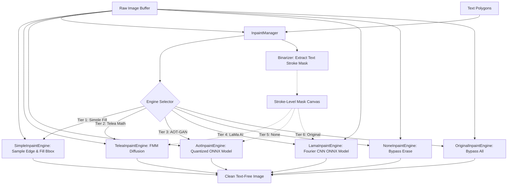

# Full Stack Spatial Image & Manga Translator (Personal Project Plan)

## 1. Project Overview & Flow
A Chrome Extension-first web application that allows users to translate text within images (like manga panels, blueprints, or diagrams), overlaying translated text in real-time, and letting users edit the result on a dynamic, local-first canvas. The core philosophy is "Local-First Storage, Dual-Compute" where all user data is stored locally, and the user can choose to compute translations locally (free) or via a cloud server (premium).

**User Flow:**
1. **Onboarding / Installation:** User installs the extension. The extension is the "Main Brain".
2. **Model Setup (Local Mode):** On first run, the extension downloads the local translation models (~100MB) from a CDN (Hugging Face) and caches them.
3. **Capture / Scrape (Option A + Manual):** User clicks "Translate" on a detected `` tag via a Content Script overlay. For protected sites (Canvas/DRM), the user can take an OS screenshot and manually upload it via the Dashboard.
4. **Compute (Dual-Mode):** The image is translated via the selected mode (Local Wasm/WebGPU or Premium Cloud API).
5. **Local DB Save:** The image, OCR boxes, and translated text are saved directly to the extension's local `IndexedDB` history (user's machine).
6. **Canvas Editing:** The user opens the extension Dashboard to edit the text boxes (change font, size, text content, position), and mark images as favorites.
7. **Export:** User exports the project as a flattened translated image or raw JSON/PSD coordinates.

## 2. Tech Stack
- **Frontend / Extension Page:** React.js (Vite) + Tailwind CSS, packaged inside a Manifest V3 Chrome Extension.
- **Backend (Cloud API Compute):** FastAPI (Python) or Express.js (RESTful API) strictly for cloud translation processing and Auth.
- **Local Database (Data & Images):** `IndexedDB` (using `Dexie.js` ORM) running inside the browser to store images as Blobs and translation history.
- **Cloud Database (Auth Only):** PostgreSQL (for managing premium user accounts/subscriptions).
- **Local AI Compute:** `Transformers.js` and `PaddleOCR` (ONNX Runtime Web) running in an Offscreen Document.
- **Image Editor/Canvas:** `react-konva` for handling the interactive canvas (moving text boxes, changing fonts).

## 3. Database System Design (Schema Draft)

### Local Database (IndexedDB / Dexie.js)
This schema lives entirely in the user's browser storage:
- **ProjectFolders:** `++id`, `title`, `timestamp`, `isFavorite` (Formerly Workspaces/Projects)
- **TranslationJobs:** `++id`, `folderId`, `rawImageBlob`, `translatedImageBlob`, `createdAt`, `updatedAt` (Formerly Images)
- **TextBlocks:** `++id`, `jobId`, `originalText`, `translatedText`, `posX`, `posY`, `width`, `height`, `fontSize`, `fontFamily`, `color`
- **Tags/Categories:** `++id`, `tagName`
- **ImageTags (Join):** `++id`, `jobId`, `tagId` 

*Crucial Architecture Constraint (Cascading Deletes):* Dexie.js is a NoSQL store and does not auto-delete children. To prevent massive local storage bloat, we must register a `db.folders.hook('deleting')` lifecycle event on initialization that manually force-deletes all orphaned TranslationJobs and TextBlocks whenever a folder is removed. 

### Cloud Database (PostgreSQL)
Only used for authentication and subscription management when the user opts for "Cloud Mode":
- **Users Table:** `id`, `email`, `password_hash`, `subscription_status`, `jwt_token_version`

## 4. Tackling Technical Unknowns (Deep Dive)

### A. How to run AI locally for Non-Tech Users (Zero Setup)
*The Problem:* We want users to translate locally without installing Python, Docker, or external keys.
*The Solution:* We use WebAssembly (Wasm) and WebGPU to run compressed models directly in JavaScript. We use a **Triple-Tier Local Translation Compute Strategy**:
1.  **Chrome Translator API (Default):** The primary default translation engine uses Chrome's built-in Translation and Language Detector APIs (available natively in Chrome 138+). It runs Gemini Nano on-device, requiring 0MB download and zero user setup, providing completely free, offline, and unlimited translation.
2.  **Transformers.js v3 (@huggingface/transformers):** Serves as a local fallback to support over 200 languages using specialized translation models like **NLLB-200** or **MarianMT**. Unlike v2, v3 supports both WebGPU and WASM execution. It integrates with our GPU acceleration settings: if WebGPU is enabled, it initializes with `device: 'webgpu'`; otherwise, it falls back to CPU via `device: 'wasm'`.
3.  **WebLLM (WebGPU):** For users with capable GPUs, we provide WebLLM to run full Large Language Models (like Llama-3.2-1B or Qwen-1.5B). LLMs provide superior contextual translation quality but require more resources and run exclusively on WebGPU.

**Unified Model Search Registry & Optimizations:**
Instead of hardcoding a massive list of downloadable models in our UI, we have implemented a high-performance dynamic model search bar combining multiple registries:
*   **WebLLM:** We read the `webllm.prebuiltAppConfig.model_list` directly from the NPM package, guaranteeing the compiled WebAssembly binaries match the engine version perfectly.
*   **ONNX / Transformers.js (Static Registry):** Instead of querying the Hugging Face API directly (which hits rate limits for 10,000+ users), we fetch a static JSON file from a GitHub CDN (`raw.githubusercontent.com`). A GitHub Action cron job updates this file weekly.
*   **MiniSearch & DOM Capping:** The UI merges both lists and displays badges (`[WebGPU]` / `[CPU]`). To ensure the popup never lags while rendering 150+ models, we use `MiniSearch` for fuzzy autocomplete, and hard-cap the DOM to only render the top 50 results at a time.

**The User Flow (Extension Dashboard & Setup):**
1. **Instant Access:** Upon extension installation, no translation model download is triggered. The default engine is set to the **Chrome Translator API**, allowing users to translate images immediately.
2. **Lazy-Loading:** If the user selects a custom NLLB-200 or WebLLM model, the dashboard displays a progress bar and begins downloading the model weights.
3. **Persistent Disk Cache:** The weights are cached permanently in Chrome's local storage (Cache API). Future translation runs load the model instantly from the local disk cache in milliseconds.
4. **VRAM/RAM Resident Singleton:** Once loaded, the engine instance is kept active in memory by the `TranslationManager` singleton. This avoids reloading weights or recompiling WebGPU shaders for subsequent images, preventing VRAM churn.

#### VRAM/Memory Lifetime & Storage Matrix

This matrix describes how each of the 5 model categories is downloaded, cached on disk, loaded into memory, and how they handle WebGPU vs. WASM fallback using the local GPU settings:

| Model Category | Download Source | Disk Caching | Memory Residency (VRAM/RAM) | GPU / WASM Fallback Logic |
| :--- | :--- | :--- | :--- | :--- |
| **1. WebLLM** | MLC CDN (auto-resolved by ID) | Cache API (automatic) | Kept in VRAM via `WebLLMEngine` singleton | WebGPU only. If GPU setting or hardware check fails, falls back to throwing an error pointing to CPU models. |
| **2. Transformers.js v3** | HuggingFace CDN (auto-resolved by ID) | Cache API (automatic) | Kept in RAM/VRAM via `TransformersEngine` singleton | Automatic fallback based on settings (`popupState`): calls `pipeline(..., { device: useWebGpu ? 'webgpu' : 'wasm' })`. |
| **3. PaddleOCR** | SDK CDN (auto-resolved by preset ID) | SDK internal cache | Kept in RAM/VRAM via `PaddleOcrEngine` singleton | Automatic fallback based on settings: initializes the SDK service with `executionProviders: useWebGpu ? ['webgpu', 'wasm'] : ['wasm']`. |
| **4. LaMa / AOT-GAN** | Custom HF Repo (resolves from local TS registry) | Browser HTTP Cache | Kept in RAM/VRAM via `InpaintManager` singleton | Automatic fallback based on settings: passes `executionProviders: useWebGpu ? ['webgpu', 'wasm'] : ['wasm']` to `InferenceSession.create()`. |
| **5. Chrome Translator** | Chrome internal (downloaded by browser) | Chrome internal cache | Managed internally by browser API | Pure CPU-based Gemini Nano on-device (no GPU setting required). |

### B. The OCR & Detection Breakthrough (PaddleOCR ONNX)
*The Problem:* We need a robust tool that does TWO things: finds the exact X/Y coordinates of text (detection) AND reads it accurately (recognition) across multiple popular languages (not just Japanese manga), all while running locally in the browser without Python.
*The Breakthrough Solution (100% Browser Local):* We will use **PaddleOCR** compiled to **ONNX WebAssembly**. 
Instead of piecing together separate complex models, we will use a pre-packaged SDK like `client-ocr` or `ppu-paddle-ocr`. 
1.  **Multi-Language:** PaddleOCR supports over 80 languages out-of-the-box (English, Japanese, Korean, Chinese, etc.).
2.  **All-in-One:** It handles both finding the bounding boxes (DB model) and reading the text (CRNN model) in a single optimized pass.
3.  **Low Complexity:** By using an NPM wrapper around the ONNX models, we avoid writing custom WebGL/WebGPU tensor logic ourselves.
*Handling Rotated Text (Polygons):* PaddleOCR returns `dt_polys` (4-point polygons) rather than simple rectangles. Because manga text is often tilted, we will use a small geometry utility to calculate the rotation angle from the polygon and apply it to our HTML overlays via CSS `transform: rotate(Xdeg)`. This ensures text perfectly aligns with slanted speech bubbles.
*Result:* We get the exact relative positions AND highly accurate multi-language text, allowing us to perfectly overlay editable text boxes over the original image. It runs entirely in the user's browser, caching the model after the first download.

*Future Implementation (Manga-Specific OCR):* While PaddleOCR is excellent for general-purpose text, future updates will introduce an optional `MangaOcrEngine.ts`. This engine will use manga-finetuned DBNet and CTC ONNX models (e.g., from `Skepsun/manga-translator-ui-onnx`). Because these models share the same DBNet architecture, their raw probability heatmaps can be fed directly into our existing pure-JS `extractPolygons()` logic to yield identical 4-point polygons, perfectly satisfying our `IOcrEngine` interface without architectural rewrites.

### C. The Chrome Extension Architecture (Web Scraping & Capture)
*The Goal:* Provide frictionless translation with two distinct modes (Auto vs Manual) controlled via a setting, while gracefully handling DRM and long WebToon strips.

*1. Auto Translate Mode (The Queue System):*
When enabled, the extension automatically finds all normal `` tags on the page and begins translating them without user interaction.
- **Concurrency Control:** To prevent crashing the browser on pages with many images, we implement a Promise-based concurrency queue. It processes a maximum of `N` images at a time (default `peak = 3`, adjustable in settings). As one image finishes, the next starts.
- **The Canvas Limitation:** Auto Mode *does not* run on protected `<canvas>` elements (like WebToons). Automatically firing `captureVisibleTab()` every time a user scrolls a pixel would rate-limit the browser and cause severe stuttering. For `<canvas>`, the extension gracefully degrades to Manual Mode.

*2. Extraction Methods (MVP vs Future):*
To keep the foundation clean (YAGNI), we will build the extraction UI in stages:
- **Method 1: Sticky Image Button (MVP FOCUS):** 
  - First option (Consistent Mode): A fast loop (via `MutationObserver`) scrapes normal `` tags and injects a "Translate" button absolutely positioned at the top-left of the image. Clicking it sends the `srcUrl` to the Background Worker. This is the sole focus for Phase 1/2.   
  - Second option: we use the native Chrome Context Menu API (`chrome.contextMenus`). The user right-clicks any standard `` and selects "Translate Image". The Background Worker natively receives the `srcUrl` and processes it.
  - Third option (Hover Mode): Instead of querying all images constantly, a global `mouseover` listener tracks the cursor. When hovering over an ``, a single floating "Translate" button appears. Both Consistent and Hover modes utilize native Chrome CSS Anchor Positioning (`anchor-name`) to perfectly track scrolling without mutating the host page's Virtual DOM.
- **Advanced Extraction (Viewport Slicing for Canvas) - deferred:** Because WebToon `<canvas>` elements can be 20,000px tall, injecting a button at the top is useless. Instead, the user right-clicks anywhere on the canvas and selects "Translate Viewport". This triggers `chrome.tabs.captureVisibleTab()` to capture and translate *only* the slice of the canvas currently visible on their screen. The translated text overlay is locked to those exact absolute scroll coordinates.
- **Method 3: The Magic Lens Crop (Future):** A draggable, resizable dashed rectangle placed anywhere on the screen. Clicking "Translate" on the box captures that specific screen slice, translates it, and overlays the result directly inside the box (with an "X" to close). Future iteration: An auto-mode that seamlessly re-translates the box contents every 5 seconds.

*The Orchestrator Pattern (Fixing Memory Limits & DB Write Constraints):*
Content Scripts run on the host website and **cannot** write to the extension's local `IndexedDB`. Data flow must strictly be: Content Script -> Service Worker -> Offscreen Document -> DB. 
Crucially, the Background Service Worker acts *only* as a lightweight traffic cop. It handles the volatile lifecycle of the Offscreen Document (which Chrome kills when idle), queuing messages until the document boots. It fetches the image buffer and passes it directly to the **Offscreen Document**, which has full DOM access and high memory limits, to execute the heavy ONNX translation and save the results to the database. This guarantees Chrome will not kill the Service Worker.

*Model Syncing (Website vs Extension & The Communication Bottleneck):*
Due to browser security, `your-website.com` and `chrome-extension://...` cannot share the same `IndexedDB` file. To solve this without hitting the **Web-to-Extension Communication Bottleneck** (passing heavy Base64 image blobs via `postMessage` crashes memory and breaks on navigation): 
1. The website will pass only the **Image URL** or use **Transferable Objects (`ArrayBuffer`)** via `window.postMessage` to the extension. Transferable objects are zero-copy and do not duplicate memory.
2. The Extension handles the heavy processing in the Offscreen Document independently of the webpage's lifecycle, returning only lightweight JSON back to the website.

### D. Editable Export (Photoshop/PSD)
*The Solution:* To allow users to download their edits, we will export a `.json` "Project File" containing the base image URL and an array of text objects (X, Y, Text). We can also include a script using `ag-psd` to compile this into a `.psd` file for Photoshop users.

### E. The "Out of Bounds" Translation Problem (Auto-Scaling Font Size)
*The Problem:* As you noted by looking at the PP-OCRv6 JSON, the OCR only gives us the bounding box coordinates (`rec_boxes` / `dt_polys`) of the *original* Japanese text. English translations are usually much longer and will overflow the original box. The OCR does not tell us what font size to use for the new text.
*The Solution (The Manga-Translator Logic & Resolving the DOM/Canvas Contradiction):* 
Because our architecture uses both HTML DOM Overlays (for on-page translation) and a React-Konva Canvas (for the dashboard editor), we must use two different scaling mathematical approaches to prevent text overflow mismatches:
1. **For the Canvas Dashboard (React-Konva):** We use Canvas `context.measureText()` to wrap words and perform a binary search, shrinking the `font-size` until the total wrapped height fits perfectly inside the bounding box.
2. **For the Content Script (HTML Overlays):** We cannot use Canvas `measureText()` because it lacks CSS engine nuance (line-height, browser-specific font rendering). Instead, we create an invisible, off-screen `
` with the exact width constraints of the bounding box. We inject the text, check `div.scrollHeight`, and recursively shrink the font size using a binary search until it matches the target height. This guarantees 1:1 CSS rendering accuracy.
3. **Centering:** We center the text horizontally and vertically within the bounding box.
*Result:* Exactly like the Python `manga-image-translator`, the text will automatically shrink and wrap to fit perfectly inside the speech bubble. Because it is a React component, the user can also manually tweak the font size via a UI slider if they don't like the automatic calculation.

### F. Removing the Original Text Cleanly (Inpainting)

*The Problem:* Before we can overlay the translated English text, we must cleanly erase the original text from the image so it doesn't bleed through. We need a solution that works for any image (manga, photos, diagrams) and runs fast locally. We must also prevent erasing speech bubble outlines, panel borders, and background line drawings.

*The Solution (6-Tier Extensible Architecture & Stroke Masking):*
To solve this, we implement a **6-Tier Hybrid Inpainting Pipeline** wrapped in a Strategy Pattern (`IInpaintEngine`), which selects the active eraser mode based on settings:

#### The Binarizer (Handling the Border-Erase Problem)
Instead of masking the entire blocky bounding box, we extract a **pixel-perfect mask of the exact text strokes**.
* **Grayscale + Otsu's Adaptive Thresholding:** Runs on each cropped text box canvas to separate high-contrast text strokes from the bubble background.
* **Polygon Masking:** Zeroes out any threshed pixels falling outside the text bounding polygons.
* **Usage:** **Tier 2 (Telea)**, **Tier 3 (AOT-GAN)**, and **Tier 4 (LaMa)** all consume this refined stroke-level mask. They only erase the text strokes, keeping bubble borders and background illustrations 100% untouched.

#### The 6 Inpainting Tiers:
1. **Tier 1: Simple Inpaint (Dominant Color Fill):** Samples pixel colors along the bounding box outer edges, determines the dominant color, and fills the bounding rectangle. Runs in microseconds (`0MB`).
2. **Tier 2: Telea Math Inpaint (FMM Diffusion):** Applies Alexandru Telea's Fast Marching Method FMM algorithm on the stroke mask, propagating surrounding background colors inward to erase characters. Extremely fast (`0MB`), preserves outlines.
3. **Tier 3: AOT-GAN Inpaint (Quantized ONNX):** Runs a lightweight generative adversarial network inpainting model. Learns manga textures and screentones to reconstruct backgrounds behind erased text. Fast (`~10MB`), runs via WebGPU when available.
4. **Tier 4: LaMa Inpaint (Fourier CNN ONNX):** Runs the Large Mask Inpainting model using Fast Fourier Convolutions to hallucinate large or complex textures globally. Highly robust, larger download (`~30MB`).
5. **Tier 5: None:** Bypasses inpainting entirely. Returns the original image. The OCR and translation pipeline will still overlay translated text on top of the original text.
6. **Tier 6: Original:** Bypasses the entire translation/inpainting pipeline and just returns a raw copy of the original image without any modifications.

#### Custom Inpainting Model Registry & URL Management
Because adding a completely new inpainting model architecture requires specific custom pre-processing and post-processing code (e.g. AOT-GAN's input tensor shape differs from LaMa's), we do not need a remote dynamic registry for inpainting. Instead, we manage custom model options via an internal local TypeScript registry file (`inpaintRegistry.ts`). This local registry maps model configurations to their remote download links (hosted on Hugging Face).
* **CI/CD Link Validation:** To ensure download URLs do not become broken or stale, we include a GitHub Action pipeline. Whenever the local registry file is modified, the action runs a validation script that fires HEAD requests to all configured Hugging Face URLs to ensure they return a valid HTTP `200 OK` response.

### G. Two-Part Frontend UX (Tampermonkey Style)
*The Problem:* How do we provide quick access to settings while also giving the user a robust, full-screen canvas editor?
*The Solution (Local-First Design):* We structure the frontend into two distinct React interfaces, mirroring extensions like Tampermonkey:
1. **The Popup Window (Quick Actions):** A small window that opens when clicking the extension icon. It handles quick operational toggles (`Auto-Translate` vs `Manual Selection Method (Hover/Persistent)`), Translation Engine selection (Local/API/Custom), and Max Concurrent Translations.
2. **The Standalone Dashboard (Full UI):** A full-screen React app hosted on an extension tab (`chrome-extension://.../index.html`). This is the "Main Brain" UI where the user accesses the interactive Canvas Editor, Recent History, Favorites, and can manually upload screenshots taken with their OS snipping tool for protected sites. All images and history are saved into the extension's local `IndexedDB`.
3. **Swappable Engine Router & Waterfall Execution:** We implement a compute Strategy Pattern. When the user initiates a translation, the Background Worker routes the task to the Offscreen Document. The Offscreen Document's `TranslationManager` reads the active engine selection and fallback waterfall chain (`[activeEngineId, ...fallbackChain]`) directly from `chrome.storage.local`. It then executes the fallback loop entirely inside the Offscreen Document, trying each engine in order. If one fails, it unloads it and dynamically spins up the next engine. This eliminates message-passing roundtrips to the UI and guarantees translation persistence even if the user closes the popup.
*Result:* This provides the absolute best UX. The user gets a completely private, full-featured app via the extension, with quick access via the popup and deep editing via the dashboard tab.

## 5. Implementation Phases
- **Phase 1 (Extension Core):** Basic Extension Setup (Manifest V3, Content Script, Popup) & Dexie.js Local DB integration for storing images/projects locally.
- **Phase 2 (Canvas Editor):** React-Konva Canvas Dashboard implementation (draggable text boxes, editable text, rendering from IndexedDB).
- **Phase 3 (Local AI Engine):** Offscreen document running PaddleOCR ONNX / MarianMT with Hugging Face CDN download progress bars.
- **Phase 4 (Cloud Premium Compute):** Server-Hosted Compute API with JWT authentication middleware + Web App Stripe checkout, communicating Auth tokens back to the extension.
## 3. Important References & Tool Links

The following tools and libraries are critical references for the development of this project:

### AI Core & Models
*   **[Transformers.js](https://huggingface.co/docs/transformers.js)**: Library for running Hugging Face models natively in the browser via ONNX Runtime Web.
*   **[PaddleOCR](https://github.com/PaddlePaddle/PaddleOCR)**: State-of-the-art multi-lingual OCR toolkit used for single-pass local detection and recognition.

### Spatial Rendering & Translation References
*   **[manga-image-translator](https://github.com/zyddnys/manga-image-translator)**: The reference Python repository for high-quality manga translation pipelines, containing text inpainting and text typesetting logic (Pillow `textbbox` implementation).
*   **[Manga Translator Chrome Extension](https://chromewebstore.google.com/detail/manga-translator%F0%9F%8D%93/lepcfgkehgeiblekejomdmdklmjdmflp)**: The primary UX reference for on-page scraper overlays and image translation.
*   **[LaMa (Large Mask Inpainting)](https://github.com/advimman/lama)**: The reference repository for high-quality image inpainting used for text removal.
### Extension & Web APIs
*   **[Chrome Offscreen Documents API](https://developer.chrome.com/docs/extensions/reference/api/offscreen)**: Documentation on managing invisible documents for image/tensor processing in Manifest V3 background scripts.
